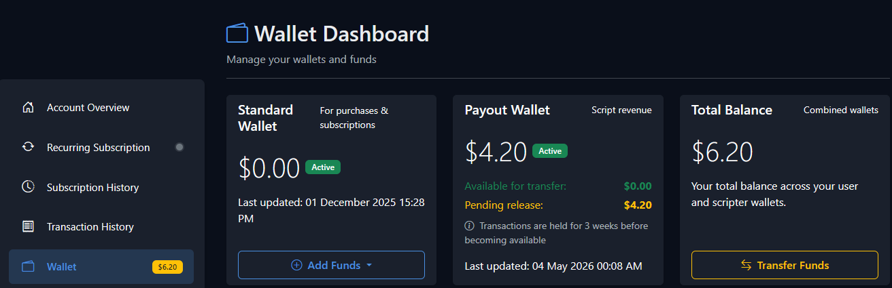
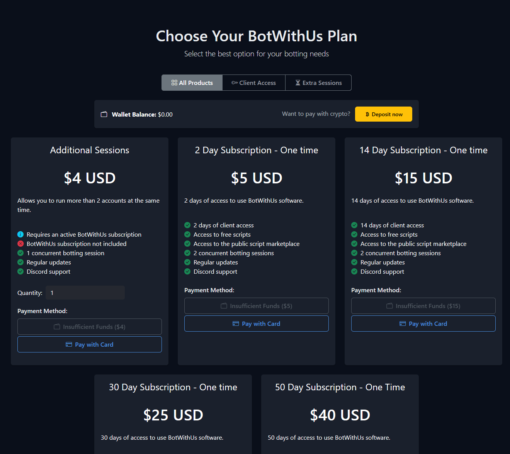

import ContentBlock from '@site/src/components/ContentBlock';
import BrowserWindow from '@site/src/components/BrowserWindow';

<ContentBlock title="Buy a subscription">
<BrowserWindow url="https://botwithus.com">

BotWithUs is paid software. Before anything else, you need an active subscription.

1. Create an account on [botwithus.com](https://botwithus.com) and sign in.
2. Choose how you want to pay — wallet top-up or direct card checkout.

**Option 1 — Top up your wallet, then subscribe**

Useful if you want to pay with crypto, or keep a balance for renewals.

- Open [**My Account**](https://botwithus.com/profile/) and under **Wallet Balance** click **Manage** (or go straight to your [**Wallet**](https://botwithus.com/wallet/)).
- Click **Add Funds** and top up with card or crypto.

> 

- Head to [**Plans**](https://botwithus.com/plans/), pick your subscription, and pay with your wallet balance.

> 

**Option 2 — Pay directly with card**

- Go straight to [**Plans**](https://botwithus.com/plans/) and pay with a card at checkout.

Once your subscription is active you can review or change it any time from [**Manage Subscription**](https://botwithus.com/subscription/manage/).

:::info Payment issues?
If a payment went through but your subscription isn't showing as active, ping a `@Dev` in the [BotWithUs Discord](https://discord.gg/botwithus) and they'll sort it out.
:::

</BrowserWindow>
</ContentBlock>

<ContentBlock title="Install the loader">

1. Head to the [**Download**](https://botwithus.com/download) page and grab the loader. The quick guide on the same page tells you which build to pick.
2. Run the installer. Defaults are fine — it puts the loader in your `BotWithUs/` user folder.
3. The first launch creates `~/BotWithUs/scripts/local/` (where your own scripts go later) and `~/BotWithUs/scripts/sdn/` (where marketplace scripts get cached).

</ContentBlock>

<ContentBlock title="Exclude the loader from antivirus">

The loader injects into the RuneScape client process, which is exactly the kind of behaviour antivirus tools like to flag. Most users hit at least one false positive.

Add an exclusion for the BotWithUs install folder *before* you run the loader for the first time. Even Microsoft Defender will quietly quarantine the executable on some systems.

- **Windows Defender:** Settings → Privacy & security → Windows Security → Virus & threat protection → Manage settings → Add or remove exclusions → Add an exclusion → Folder → pick your `BotWithUs` install folder.
- **Third-party AVs (Avast, Bitdefender, Kaspersky, Malwarebytes, etc.):** add the same folder to the AV's allow/exclusions list. The exact menu varies, but every AV has one.

If the loader vanishes a few seconds after you launch it, or never produces a window at all, antivirus is the first thing to check. The loader is signed and clean — it's the injection that triggers heuristics.

</ContentBlock>

<ContentBlock title="First launch — sign in">

1. Start the loader.
2. Sign in with the same account you used on [botwithus.com](https://botwithus.com). The loader fetches your active subscription from the website automatically — there's no separate serial or activation key.
3. Once you're signed in, the toolbar lights up and you're ready to add a game account.

</ContentBlock>

**Next:** [launching accounts →](./02-launching-accounts.md)
