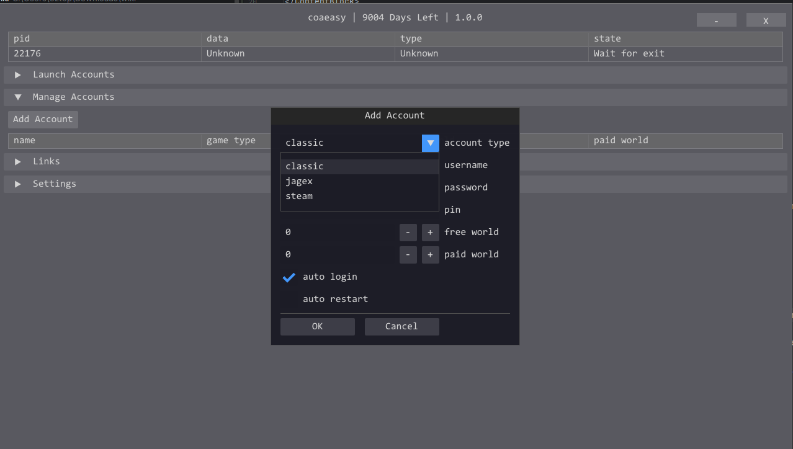
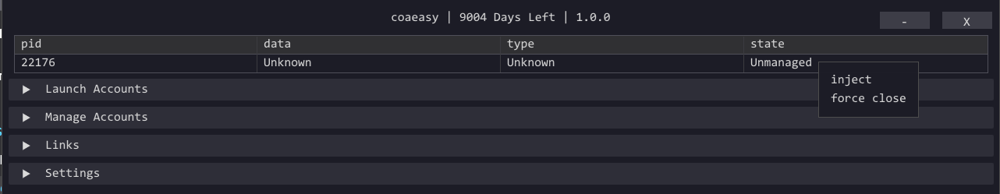

import ContentBlock from '@site/src/components/ContentBlock';

<ContentBlock title="Two account types">

RuneScape has two login systems. **Both run directly from the BotWithUs loader** — the only difference is how the loader gets hold of your accounts.

| Account type | How you log in normally | What you'll do here |
|---|---|---|
| **Classic** | Username + password directly into the game | Save credentials in the **account manager**, then create a session |
| **Launcher** | The launcher → click an account tile | Have the **launcher open** so the loader can pull your accounts in, then create a session |

If you're not sure which you have: if you log in through the **launcher**, it's a launcher account.

</ContentBlock>

<ContentBlock title="Launching a classic account">

This is the simpler path.

1. In the loader, open the **Account Manager** (button on the toolbar).
2. Click **Add account** and enter your username and password.
   - You can leave credentials blank, but **autologin won't work** if you do.

> 

3. Save the entry.
4. Back on the main loader screen, click **Launch account** then select classic or launcher.
5. Choose your saved account from the list.
6. Click **Launch session**.

A game client window opens. After about **5 seconds**, BotWithUs injects into it. You'll know injection succeeded when the **BotWithUs logo** appears in the corner of the client — this is a prerequisite for opening the bot menu in [chapter 3](./03-bot-menu.md).

> 

</ContentBlock>

<ContentBlock title="Launching a launcher account">

Launcher accounts can't store credentials inside the loader — the launcher handles that. The loader pulls your accounts straight from the launcher, so it just needs to be **open** in the background.

1. Open the **launcher** and sign in.
2. Switch to the **BotWithUs loader**.
3. Click **Add account**, and select the account type.
4. Click **Clear and repopulate** — the loader will re-read your accounts from the Jagex Launcher.
5. Click **Launch session**.

The loader starts the client and BWU injects. It may take up to 10 seconds for the loader overlay to show in-game.

</ContentBlock>

<ContentBlock title="Session limits">

- Your basic subscription allows for 2 sessions, any additional session can be purchased on the website if you want to bot more accounts at the same time.
- Closing the client frees a slot.

</ContentBlock>

**Next:** [the bot menu →](./03-bot-menu.md)
