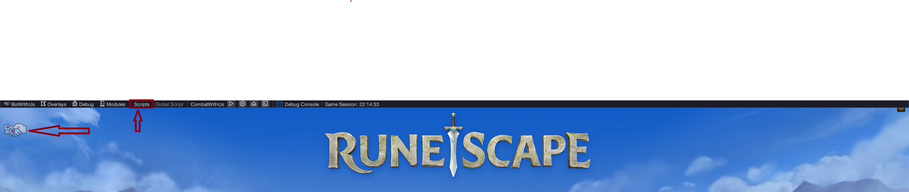
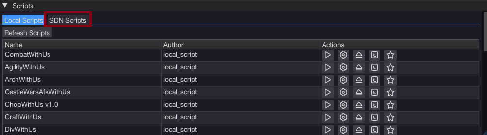
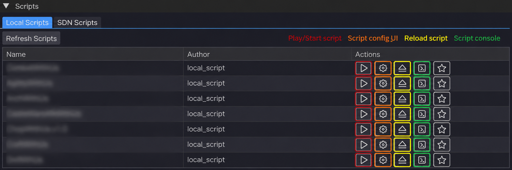

import ContentBlock from '@site/src/components/ContentBlock';

<ContentBlock title="Opening the menu">

This chapter assumes you've already launched a client and BotWithUs has injected — see [chapter 2](./02-launching-accounts.md) if the BWU logo isn't showing in the corner yet.

Open the **bot menu** in two ways:

- Press **Insert** on your keyboard, **or**
- Click the **BotWithUs logo** in the corner of the client.

The overlay opens on top of the game. From there, click **Scripts** to bring up the scripts window.

> 

</ContentBlock>

<ContentBlock title="Scripts vs SDN Scripts">

Inside the scripts window you'll see two tabs. Switch to the **SDN** tab to see anything you've subscribed to from the marketplace.

> 

| Tab | Where the scripts come from                       | When you'd use it |
|---|---------------------------------------------------|---|
| **Scripts** | `.jar` files you put in your local scripts folder | Scripts you wrote, or custom ones a friend sent you |
| **SDN** | The BotWithUs marketplace, downloaded on request  | Anything you've subscribed to on [botwithus.net/sdn](https://botwithus.net/sdn) |

You'll meet "Scripts" again in [chapter 5](./05-first-script.md) when you build your own.

</ContentBlock>

<ContentBlock title='"I subscribed but no scripts are showing up"'>

Two things to check:

1. **Did you actually subscribe on the website?** Browse [botwithus.net/sdn](https://botwithus.net/sdn), click a script, and confirm it.
2. **Hit Refresh in the SDN tab.** No need to restart the loader — just click **Refresh** in the SDN tab and your new subscriptions will load.

After that, the script should appear under the **SDN** tab in the scripts window. Press the load button to start the download (usually instant or only a few seconds).

</ContentBlock>

<ContentBlock title="Running a script">

Same flow for both tabs:

1. Click the script's name in the list.
2. Its options window appears (every script has its own — read what it asks for).
3. Click **Play** to start the script. Some scripts have their own play button inside the script's configuration UI — use whichever the script provides.
4. Watch your character act on screen, and watch the script console for any issues.

> 

To stop a script, click **Stop** in its window (it replaces the Play button). Closing the script's configuration window with the configuration icon does **not** stop the script — only **Stop** does. The main overlay can be hidden the same way: press **Insert** or click the BWU logo.

</ContentBlock>

**Next:** if you only want to *use* scripts, you're done. To start writing your own, head to [setting up your coding environment →](./04-ide-setup.md).
