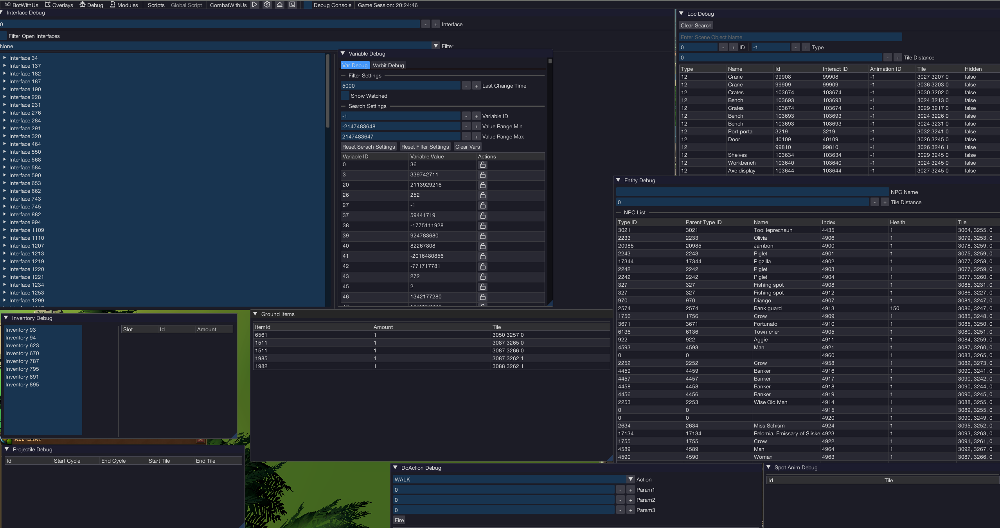

import ContentBlock from '@site/src/components/ContentBlock';

<ContentBlock title="Why you need them">

Chapter 6 told you *what* the game exposes (varbits, NPCs, animations, etc.). This chapter shows you the **debug overlays** — small windows BotWithUs draws on top of the game that let you watch all of that live.

Without overlays, finding "the varbit that flips when I pick up an item" means digging through the cache dump or printing values to the script console at runtime. The overlays cut that loop down to seconds.

> 

</ContentBlock>

<ContentBlock title="Opening overlays">

1. Inject into a client and open the **bot menu** (Insert).
2. Look for a **Debug** tab in the menu.
3. Toggle each overlay you want. They appear as draggable windows on top of the game.

You can have many open at once. Drag them by their title bar; resize from the bottom-right corner.

</ContentBlock>

<ContentBlock title="Overlays you'll actually use">

These are the workhorses. Pick the one that matches what you're trying to find.

#### Player

Shows your own character's current state: position, animation ID, world tile etc...

**Use it when:** you want to know if your player is currently doing something. Watch `Animation ID` flip from `-1` (idle) to a specific number when you click a tree, attack a monster, drink a potion. That number is your "player is busy" check.

#### NPC

Lists every NPC currently in the scene with their name, ID, animation ID, and position. Click one to focus its details.

**Use it when:**
- You need an NPC's **ID** to query for it cleanly.
- You're hunting the **animation ID** of a boss's special attack — open this, watch the boss, note which animation number flashes during the wind-up.

#### Scene Object

Same idea for objects in the world. Lists trees, doors, banks, etc. with their names, IDs, and right-click options.

**Use it when:**
- You don't know what name BotWithUs uses for an object (the in-game tooltip and the API name don't always match).
- You're checking that an object's **interact options** are what you expect ("Mine", "Quick-mine", etc.).

#### Varbit / Varp Watcher

Lists varbits and varps with their current values. **Big asymmetry:** varps populate the watcher automatically — when one changes, you see it. Varbits **do not** auto-populate; the overlay can only show varbit IDs you've explicitly told it to watch (you cannot scan them live).

**Use the watcher for varps when:** you need an unknown ID for a quest stage, a setting toggle, a phase counter. Procedure: filter to "changed recently" → do the in-game action → glance at which varp value flipped → that's your varp.

**For varbits, the watcher is not the find tool.** You'll usually:

- Look the varbit up in the **cache dump** (`latest_varbits.json`, chapter 8) by name/context, or
- Grab it from the BotWithUs **Discord data channels**, which keep curated lists for common things like potion timers and prayer flags, or
- If you've already found the *varp* with the watcher, drill down to which bit-range inside that varp moved — that's your varbit.

#### Projectile Viewer

Live list of projectiles flying through the scene with their source, target, and ID.

**Use it when:** writing a boss script. You watch the boss attack and read the projectile ID off this overlay so your script can react to it next time.

#### Component / Interface

Lists every UI element ("interface component") on screen with its IDs and current text.

**Use it when:** you need to click a specific button on an interface, or read text from the chat box, the bank window, a dialog.

#### Spot Animation Viewer

Lists active spot animations (those graphics-only effects that aren't tied to a character).

**Use it when:** the cue you need is an effect on the ground (an AOE marker, an explosion, a teleport sparkle) rather than a character animation.

</ContentBlock>

<ContentBlock title="The find-by-changing trick">

This is the single most useful technique in the whole tutorial — for everything *except* varbits. You'll use it constantly.

To find any unknown game value (varps, NPC fields, projectile IDs, animation IDs, scene-object state):

1. Open the relevant overlay (varp watcher, NPC, projectile viewer — whichever matches).
2. Trigger the in-game event you care about — drink the potion, attack the boss, click the door.
3. Note which row(s) and what value they changed *to*.
4. That's your ID and target value.

Example — *"What's the varp that holds my Overload buff state?"*

1. Open the varp watcher, clear it.
2. Drink an Overload.
3. Multiple rows update, but since we're looking for a buff timer (a clear before/after) we can usually deduce which one matters. That row's ID is your "overload active" varp.
4. If you actually need the **varbit** inside that varp (because the engine packs several flags into one varp), open the cache dump's `latest_varbits.json` and find the varbits whose `varpId` matches — then pick the one whose bit-range covers the bits that flipped.

:::warning Varbits don't show up here automatically
The find-by-changing trick **does not work for varbits** — the watcher can't scan them live, it only displays IDs you explicitly add. To find a varbit ID, use the **cache dump** (chapter 8), the BotWithUs **Discord data channels** (curated lists for prayers, potions, common buffs), or the "find the varp first, then drill down" approach above.
:::

</ContentBlock>

<ContentBlock title="Workflow tip — keep a notes file">

You'll find a lot of IDs while working on a script. Keep a plain `.txt` file open next to IntelliJ and dump them as you go:

```
Magic tree         object_id: 38755
Chop animation     anim_id:   24937
Boss special wind  anim_id:   12345
```

Future-you will thank present-you. A boss script can easily collect 30+ IDs.

</ContentBlock>

<ContentBlock title="When the overlay shows the wrong thing">

A few common gotchas:

- **Multiple matching results.** "Magic tree" might appear twice (the visible tree, plus a stump waiting to respawn). The inspector shows them as separate rows — make sure your script's filter (`.name(...)`, `.option(...)`, `.hidden(false)`) picks the right one.
- **Varbit IDs differ between RuneScape versions.** When game updates ship (chapter 2), some IDs can also shift. If a working script suddenly doesn't, run the find-by-changing trick again to confirm the IDs you stored are still right.

</ContentBlock>

You can now (a) read the game and (b) find the specific IDs you need. The next chapter shows you how to skip the "look it up live" step entirely for static data — pulling it straight from the cache.

**Next:** [cache data gathering →](./08-cache-data.md)
