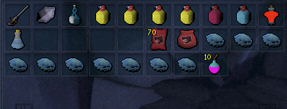

import React from 'react';
import TopBanner from '@site/src/components/TopBanner';
import ContentBlock from '@site/src/components/ContentBlock';
import Changelog from '@site/src/components/Changelog';
import BrowserWindow from '@site/src/components/BrowserWindow';
import changes from './changes.json'

<TopBanner title="HM Kerapac " version="v1.0" author="Akisame" skill="Necromancy">
</TopBanner>

:::hidden

## Cost

:::

<ContentBlock title="Cost">
> - $55 USD / month (not including client access)
:::danger Limitations
- **Be aware, This boss require very good gear and high requirements, deaths can still happen**
- **Be aware : You need a Normal Mode kill to unlock the Hard Mode version of this boss**
- **Be aware : Fully upgraded Enriched pontifex shadow ring is required**
:::
</ContentBlock>

:::hidden

## Features

:::

<ContentBlock title="Features">

> - **HM Kerapac Loots**: HM Kerapac Drops tier 95 magic weapon (FSOA) and good common drops average 47M / H

> - **Mechanics**: All mechanics are handled, in case of lightning phase make sure you have a Powerburst of Vitality in inventory

> - **Hopping Worlds System**: You can setup a timer to hop worlds every X minutes, you also have the possibility to choose your region

> - **Bank pin**: You have the possibility to add your bank pin along with a hide pin option.

> - **Prayers**: Handle curses and normal prayers.

> - **Supported books**: Supported books are : Ful, Wen, Jas, Grimoire, Amascut.

> - **Usefull Items**: Excalibur and Ancient ritual shard will be used automaticaly if in inventory.

> - **Powders**: Powder of Penance / Powder of Protection are supported.

> - **Vuln Bombs**: Vulnerability bombs are supported.

> - **Auras**: Aura rotation are supported along with a refresh aura potion.

> - **Familiars**: Supported familiars are, Hellhound / Blood Reaver / Ripper Demon / Kal'Gerion Demon. Scrolls are supported.

> - **Supported Potions**: All type of Overloads/Restores/Adrenaline/Weapon Poison/Saradomin brews are supported.

> - **Average Kill Times**: Averaging 5:00 - 5:30.

> - **Starting the fight**: Script can be started in front of Kerapac entrance if War's portal not unlocked.

> - **Conjures**: Equip an Excalibur before teleporting out to remove the conjures.

</ContentBlock>

:::hidden

## Requirements

:::
<ContentBlock title="Requirements">

> **Make sure you meet the requirements below**
> - Make sure you have 4 free spaces in your inventory
> - Foods / Overload / Restore / Saradomin Brew / Weapon Poison / Adrenaline Potion / Vuln Bombs
> - Enchanced devotion + dps perk on your gear  
> - Good relics (Fury of the small, Death Ward, Conservation of Energy)
> - Fully upgraded pontifex shadow ring (To void being stun my slam mechanic)
> - Action Bar should be on full Manual
> - Ability Queing should be off
> - Auto Attacks should be on
> - Auto Reliate should be off
> - Prayers, Equipments, Inventory and Summonning tabs should be open and visible
> - A minimum of 15,000 Divine charges is required (if using augmented gear)
> - A minimum of 500 of each necromancy runes and ectoplasm is required
> - A minimum of 500 Astal, Blood and Souls runes is required if using Prism of Restoration
> - War's Retreat Teleport
> - War's Altar
> - Double Surge
> - Boss portal set to Kerapac (Left or Right)
</ContentBlock>
<ContentBlock title="Optional Requirements">

> **Having all Possible requirements ticked on will ensure a much better kill and result from this script**
> - Essence of Finality.
> - Weapon Special Attack.
> - Weapon Poison+++.
> - Vuln Bombs.
> - Darkness.
> - Limitless.
> - Life Transfer.
> - Invoke Death.
> - Bonefire
> - Adrenaline Crystal (Starting at 100% adrenaline for more dps is recommanded)
> - Kerapac portal is optional (can start the script in front of Kerapac instance)

</ContentBlock>
:::hidden

## Setup

:::
<ContentBlock title="Setup">

<strong>Action Bar Setup</strong>

> - Please make sure all mandatory abilities are on your bar.
> - Please make sure all optional abilities if options are checked. (Note Darkness and Invoke death are highly recommanded) 

<strong>Inventory Setup</strong>

> **Make sure your preset contains the following**

 

> - Elder or slave overloads.
> - Vuln Bombs.
> - Powerburst of Vitality.
> - Weapon Poison+++.
> - Saradomin Brews and Blue blubbers.
> - Restores potions.
> - Familiar with scrolls.
> - Necromancy runes, in your inventory or in your Nexus
> - Cinderbane is recommanded.
> - Zuk cape.
> - Active dps book.

<strong>Settings Setup</strong>

> **General Settings**

> **Equipment Settings**

> **Spells And Prayers Settings**

> **Auras Settings**
> - I recommand Equilibrium if using Occultist's ring if not Mahjarrat

> **Healing Settings**
> - I recommand 55 For brews / 50 for foods / 90 for excalibur

</ContentBlock>

:::hidden

## Changelog

:::

<Changelog changes={changes}>

</Changelog>
