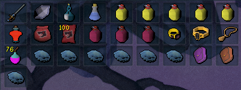

import React from 'react';
import TopBanner from '@site/src/components/TopBanner';
import ContentBlock from '@site/src/components/ContentBlock';
import Changelog from '@site/src/components/Changelog';
import BrowserWindow from '@site/src/components/BrowserWindow';
import changes from './changes.json'

<TopBanner title="Aki Zamorak" version="v1.0" author="Akisame" skill="Necromancy">
</TopBanner>

:::hidden

## Cost

:::

<ContentBlock title="Cost">
> - $80 USD / month (not including client access)
:::danger Limitations
- **Be aware, This boss require very good gear and high requirements, deaths can still happen**
:::
</ContentBlock>

:::hidden

## Features

:::

<ContentBlock title="Features">

> - **Zamorak Loots**: Zamorak Drops tier 95 Ranged weapon and T95 Melee Armor and good common drops average 80M/H at 100% - 500% Enrage

> - **Mechanics**: All mechanics are handled

> - **Hopping Worlds System**: You can setup a timer to hop worlds every X minutes, you also have the possibility to choose your region

> - **Bank pin**: You have the possibility to add your bank pin along with a hide pin option.

> - **Prayers**: Handle curses and normal prayers.

> - **Supported books**: Supported books are : Ful, Wen, Jas, Grimoire, Amascut.

> - **Usefull Items**: Excalibur and Ancient ritual shard will be used automaticaly if in inventory.

> - **Rewards Tracker**: Tracking rewards / GP/H.

> - **Reroll Rewards**: Possibility to reroll rewards based on ur settings.

> - **Enrage Mode**: Possibility to choose between Custom Enrage, Used last Enerage and Streak Enrage Mode.

> - **Powders**: Powder of Penance / Powder of Protection are supported.

> - **Vuln Bombs**: Vulnerability bombs are supported.

> - **Auras**: Aura rotation are supported along with a refresh aura potion.

> - **Familiars**: Supported familiars are, Hellhound / Blood Reaver / Ripper Demon / Kal'Gerion Demon. Scrolls are supported.

> - **Supported Potions**: All type of Overloads/Restores/Adrenaline/Weapon Poison/Saradomin brews are supported.

> - **Average Kill Times**: Averaging 7:00 - 10:30. Depending on enrage

> - **Starting the fight**: Script can be started in front of Zamorak entrance if War's portal not unlocked.

> - **Conjures**: Equip an Excalibur before teleporting out to remove the conjures.

</ContentBlock>

:::hidden

## Requirements

:::
<ContentBlock title="Requirements">

> **Make sure you meet the requirements below**
> - Foods / Overload / Restore / Saradomin Brew / Adrenaline Potion / Vuln Bombs
> - Good perks are required (Better perk can handle higher Enrage)
> - Good relics (Fury of the small, Death Ward, Conservation of Energy)
> - Action Bar should be on full Manual
> - Ability Queing should be off
> - Auto Attacks should be on
> - Auto Reliate should be off
> - Prayers, Equipments, Inventory and Summonning tabs should be open and visible
> - A minimum of 15,000 Divine charges is required (if using augmented gear)
> - A minimum of 500 of each necromancy runes and ectoplasm is required
> - A minimum of 500 Astal, Blood and Souls runes is required if using Prism of Restoration
> - War's Retreat Teleport
> - War's Altar
> - Double Surge
> - Boss portal set to Zamorak (Left or Right)
</ContentBlock>
<ContentBlock title="Optional Requirements">

> **Having all Possible requirements ticked on will ensure a much better kill and result from this script**
> - Essence of Finality. (Highly recommanded)
> - Weapon Special Attack. (Highly recommanded)
> - Ring of Death can be Usefull to clutch P7 (Highly recommanded)
> - Vuln Bombs. (Highly recommanded)
> - Darkness. (Highly recommanded)
> - Limitless.
> - Life Transfer.
> - Invoke Death. (Highly recommanded)
> - Bonefire
> - Adrenaline Crystal (Starting at 100% adrenaline for more dps is recommanded)
> - Zamorak portal is optional (can start the script in front of Zamorak instance)

</ContentBlock>
:::hidden

## Setup

:::
<ContentBlock title="Setup">

<strong>Action Bar Setup</strong>

> - Please make sure all mandatory abilities are on your bar.
> - Please make sure all optional abilities if options are checked. (Note Darkness, Invoke death, EOF, Weapon Special are highly recommanded for higher enrage) 

<strong>Inventory Setup</strong>

> **Make sure your preset contains the following**

 

> - Elder or slave overloads.
> - Vuln Bombs.
> - Powerburst of Vitality.
> - Saradomin Brews and Blue blubbers.
> - Restores potions.
> - Familiar with scrolls.
> - Necromancy runes, in your inventory or in your Nexus
> - Runes for Disruption Shield
> - Zuk cape.
> - Active dps book.

<strong>Settings Setup</strong>

> **General Settings**

> **Equipment Settings**

> **Spells And Prayers Settings**

> **Auras Settings**
> - I recommand Equilibrium if using Occultist's ring if not Mahjarrat

> **Healing Settings**
> - I recommand 55 For brews / 50 for foods / 90 for excalibur

> **Zamorak Settings**

</ContentBlock>

:::hidden

## Changelog

:::

<Changelog changes={changes}>

</Changelog>
