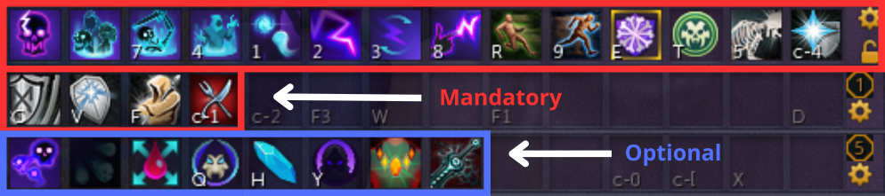
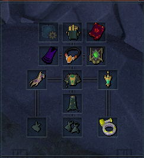
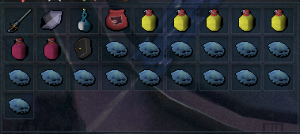
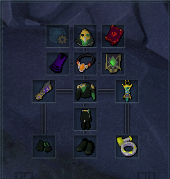
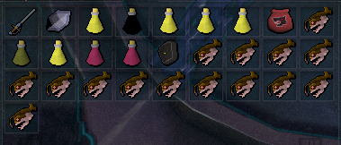
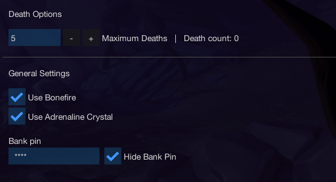
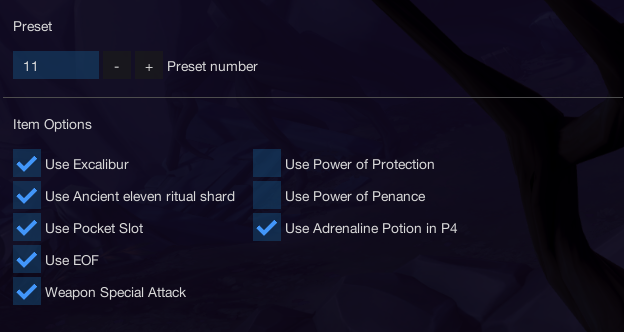
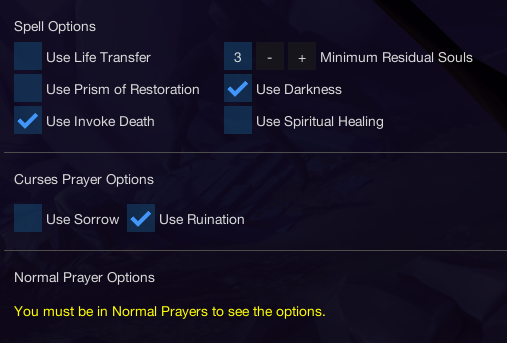
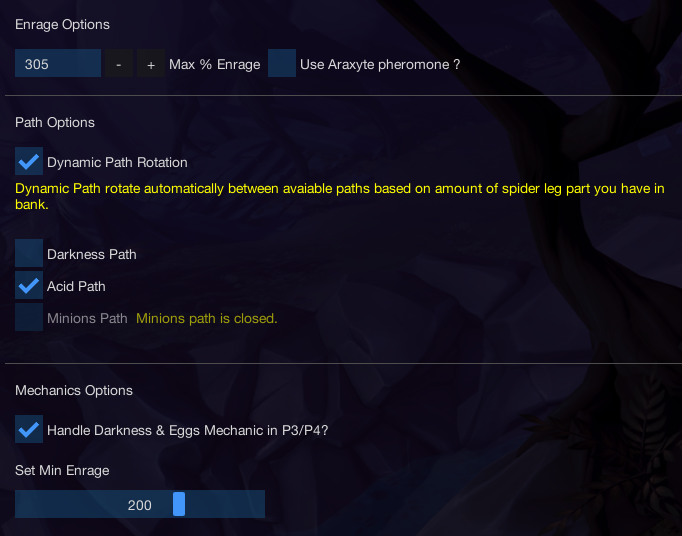

import React from 'react';
import TopBanner from '@site/src/components/TopBanner';
import ContentBlock from '@site/src/components/ContentBlock';
import Changelog from '@site/src/components/Changelog';
import BrowserWindow from '@site/src/components/BrowserWindow';
import changes from './changes.json'

<TopBanner title="AraxxorWithUs" version="v1.0" author="BotWithUs" skill="Necromancy">
</TopBanner>

:::hidden

## Cost

:::

<ContentBlock title="Cost">
> - $18 USD / weekly (not including client access)
</ContentBlock>

:::hidden

## Features

:::

<ContentBlock title="Features">

> - **Araxxi Loots**: Araxxi (Drop Saradomin Flask(6) / Uncut Onyx / T90 Weapons also used for bis components)

> - **Enrage**: You can setup a max % enrage before teleporting out (Also the possibility to clear the enrage with Araxyte pheromone)

> - **Mechanics**: All mechanics are handled + all 3 Paths are avaiable (Darkness Path, Acid Path, Minions Path), You can also setup a minimum enrage before starting to handle Eggs and Darkness mechanics in P3/P4

> - **Hopping Worlds System**: You can setup a timer to hop worlds every X minutes, you also have the possibility to choose your region

> - **Dynamic Path Rotation System**: Dynamic Path rotate automatically between avaiable paths based on amount of spider leg part you have in your bank.

> - **Bank pin**: You have the possibility to add your bank pin along with a hide pin option.

> - **Prayers**: Handle curses and normal prayers.

> - **Supported books**: Supported books are : Ful, Wen, Jas, Grimoire, Amascut.

> - **Usefull Items**: Excalibur and Ancient ritual shard will be used automaticaly if in inventory.

> - **Powders**: Powder of Penance / Powder of Protection are supported.

> - **Auras**: Aura rotation are supported along with a refresh aura potion.

> - **Familiars**: Supported familiars are, Hellhound / Blood Reaver / Ripper Demon / Kal'Gerion Demon. Scrolls are supported.

> - **Supported Potions**: All type of Overloads/Restores/Adrenaline/Saradomin brews are supported.

> - **Average Kill Times**: Averaging 3:30 - 4:00 depending on path.

> - **Starting the fight**: Script can be started in front of Araxxi entrance if War's portal not unlocked.

</ContentBlock>

:::hidden

## Requirements

:::
<ContentBlock title="Requirements">

> **Make sure you meet the requirements below**
> - Foods / Overload / Restore / Saradomin Brew
> - Action Bar should be on full Manual
> - Ability Queing should be off
> - Auto Attacks should be on
> - Auto Reliate should be off
> - Prayer tab should be open and visible
> - A minimum of 15,000 Divine charges is required (if using augmented gear)
> - A minimum of 500 of each necromancy runes and ectoplasm is required
> - A minimum of 500 Astal, Blood and Souls runes is required if using Prism of Restoration
> - War's Retreat Teleport
> - War's Altar
> - Double Surge
> - Boss portal set to Araxxi (Left or Right)
</ContentBlock>
<ContentBlock title="Optional Requirements">

> **Having all Possible requirements ticked off will ensure a much better kill and result from this script**
> - Essence of Finality.
> - Weapon Special Attack.
> - Prism of Restoration.
> - Darkness.
> - Life Transfer.
> - Invoke Death.
> - Spiritual healing
> - Bonefire
> - Adrenaline Crystal
> - Araxxi portal is optional (can start the script in front of Araxxi instance)

</ContentBlock>
:::hidden

## Setup

:::
<ContentBlock title="Setup">

<strong>Action Bar Setup</strong>

> - Please make sure all mandatory abilities are on your bar.
> - Please make sure all optional abilities if options are checked.

<strong>Inventory Setup</strong>

> **Two types of Setups, Low cost and a more exepensive one**

 
 

> *Make sure your preset contains the following...*
> - Any Overload potion.
> - Any Antipoison potion.
> - Saradomin Brews and Food.
> - Restores potions.
> - Necromancy runes, in your inventory or in your Nexus

<strong>Settings Setup</strong>

> **General Settings**

> **Equipment Settings**

> **Spells And Prayers Settings**

> **Araxxi Settings**
> - I recommand handling Eggs and Darkness mechanics in P3/P4 at 150% if T90 or 200% if T95
> - If you want to camp 300% enrage set the enrage above 300%

</ContentBlock>

:::hidden

## Changelog

:::

<Changelog changes={changes}>

</Changelog>
