import React from 'react';
import TopBanner from '@site/src/components/TopBanner';
import ContentBlock from '@site/src/components/ContentBlock';
import Changelog from '@site/src/components/Changelog';
import BrowserWindow from '@site/src/components/BrowserWindow';
import changes from './changes.json'

<TopBanner title="ArchGlacorNM" version="v1.0" author="MonVardsDraguns & andri588" skill="Necromancy">
</TopBanner>

:::hidden

## Cost

:::

<ContentBlock title="Cost">

> - 10 Coin / month (not including client access)

</ContentBlock>

:::hidden

## Features

:::

<ContentBlock title="Features">

> - Completes up to 5 mechanics.
> - Manages to complete kills with all styles.
> - Toggle for eating food/using prayer.
> - Manages loot, healing, and prayer use.
> - Handles banking, world-hopping.
> - Repairs Fury amulet of blood, Cinderbane gloves.
> - Charges up Scripture of Wen.
> - Grand Exchange integration for restocking supplies such as runes, food, and potions.
> - Discord notifications via webhook.
> - Customizable kill count before hopping worlds
> - Customizable kill count before banking
> - Simple GUI for easy control of all the bot settings
> - Removes treasure hunter keys that pop-up in the backpack
> - Option to eat food to make space for loot
> - Option to leave loot on ground
> - Uses War's retreat altar if its unlocked
> - Uses War's retreat adrenaline crystal if its unlocked
> - Toggle to open crystal chests with gathered crystal keys after a set amount
> - Supports curses/normal prayers
> - Uses bone shield for necromancy to use defensives on frost cannon mechanic
> - Uses a shield switch for Range/Melee/Mage to use defensives on frost cannon mechanic
> - Logic of all 4 styles to deal with Glacytes (Dragon breath, bombardment, cleave, other aoes)
> - Toggles Scripture of Wen
> - Supports Weapon poison +++
> - Supports restore/prayer potions

</ContentBlock>

:::hidden

## Requirements

:::

<ContentBlock title="Requirements">

> - War's retreat portal must be on action bar
> - Arch glacor portal must be unlocked and set in one of the 2 portals in War's retreat
> - All abilities/prayers that you want to use have to be on Actionbar (will use the best stat boosting prayer it can from the actionbar)
> - Eat Food must be on bar for food to be eaten
> - The script will load preset 1 to go fight the boss
> - To repair fury blood amulet you have to have blood runes in bank
> - To repair cinderbanes you must have whetstones in bank
> - To charge wen scripture you have to have wen pages in bank
> - Supports REVO++ bar, the fighting phase doesn't have custom ability rotations
> - Equipment interface has to be opened for item fixing to work
> - If using Necromancy bone shield has to be on for frost cannon mechanic

</ContentBlock>

:::hidden

## Info

:::

<ContentBlock title="Info">

> - Buys 5000 of each rune/ectoplasm
> - Buys 3000 Rocktails
> - Buys 1000 of arrows/bolts
> - Buys 300 of Extreme Potions/super restore
> - Buys 100 Powerburst of vitality
> - Buys 50 Weapon poison +++
> - Buys 10 Manuscript of Wen/Whetstone

</ContentBlock>

:::hidden

## Discord Webhook Tutorial

:::

<ContentBlock title="Set up webhook">

  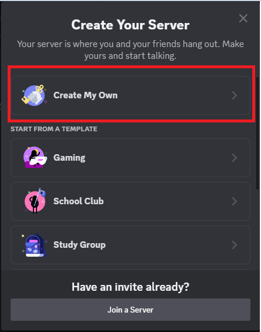
  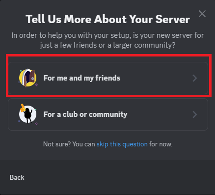
  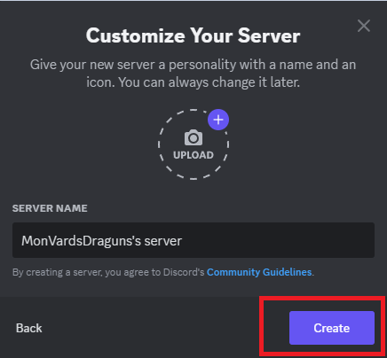
  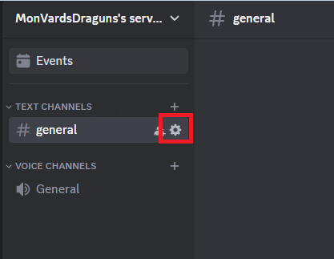
  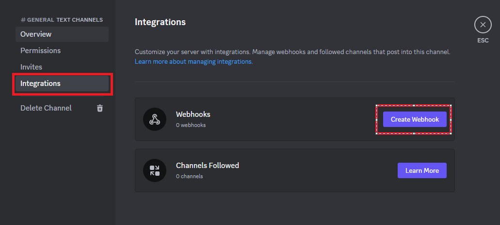
  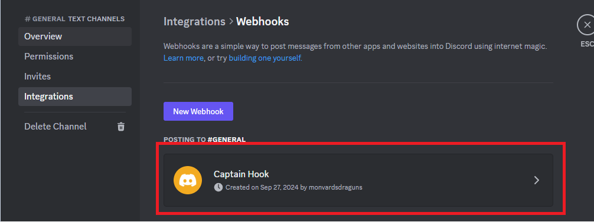
  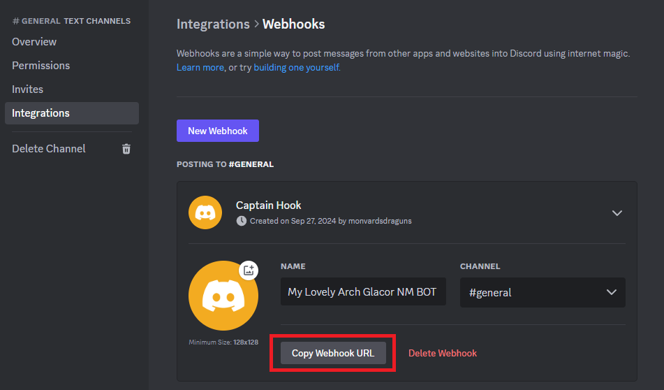
  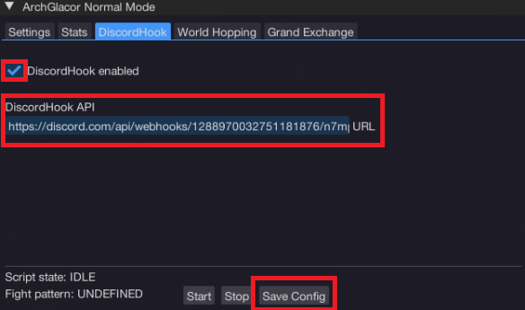

</ContentBlock>

:::hidden

## GUI

:::

<ContentBlock title="GUI">

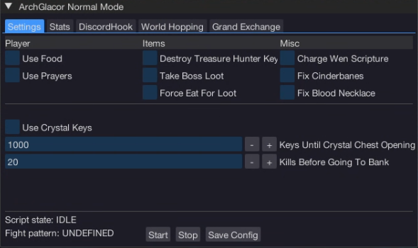
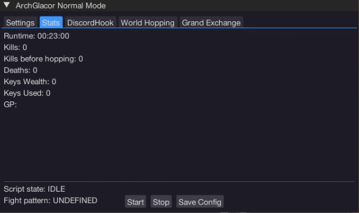
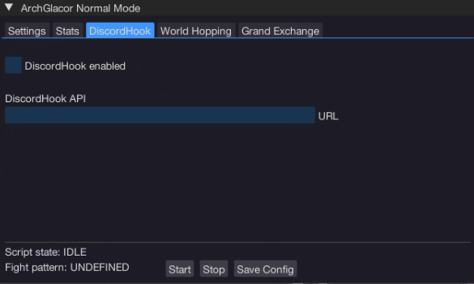
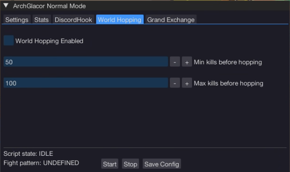
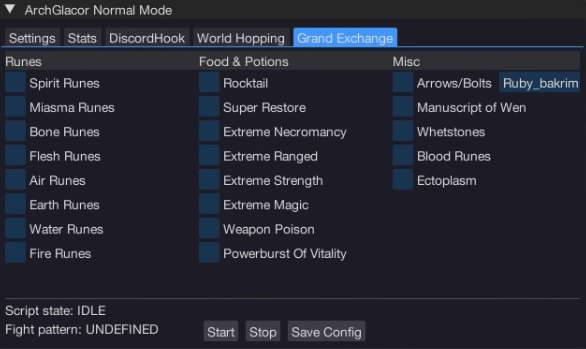
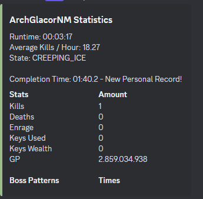

</ContentBlock>

:::hidden

## Changelog

:::

<Changelog changes={changes} >

</Changelog>