import React from 'react';
import TopBanner from '@site/src/components/TopBanner';
import ContentBlock from '@site/src/components/ContentBlock';
import Changelog from '@site/src/components/Changelog';
import BrowserWindow from '@site/src/components/BrowserWindow';
import changes from './changes.json'

<TopBanner title="ED3WithUs" version="v1.0" author="BotWithUs" skill="Necromancy">
</TopBanner>

:::hidden

## Cost

:::

<ContentBlock title="Cost">
> - **18 USD / weekly** (client access not included)
</ContentBlock>

:::hidden

## Features

:::

<ContentBlock title="Features">

> - **Combat Style**: Necromancy support with T90/T95 (not a hard requirement)
> - **Banking Options**: War's Retreat or Max Guild banking with smart checkpoint support
> - **Prayers**: Curse prayer support (Sorrow T95 / Ruination T99)
> - **Scripture Support**: Ful, Wen, Jas, Grimoire - automatic refilling
> - **Aura System**: Queue-based aura rotation with automatic reset support
> - **Familiars**: Hellhound, Blood Reaver, Ripper Demon, Kal'Gerion Demon with scroll usage
> - **Consumables**: Overloads, Restore potions, Adrenaline, Saradomin brews, Guthix rest
> - **Average Completion**: 20-25 minutes depending on gear tier and banking configuration
> - **Flexible Start**: Begin at War's Retreat portal, Max Guild, or instance entrance
> - **Equipment Management**: Auto-swap for Salve Amulet, Essence of Finality, Cinderbane Gloves
> - **Gear Refill**: Automatic scripture, divine charge, and EOF recharging
> - **Pre-Fight Setup**: Campfire, thermal pool, incense sticks, powders support
    </ContentBlock>

:::hidden

## Requirements

:::
<ContentBlock title="Essential Requirements">

> **Game Settings**
> - Action Bar: Full Manual mode
> - Ability Queuing: Disabled
> - Auto Attacks: Disabled
> - Auto Retaliate: Disabled
> - Bone Shield spell: Active
>
> **Action Bar Setup**
> - Deflect prayers (curses)
> - War's Retreat or Max Guild teleport
> - Double Surge and Dive (requires Mobile perk or Shadow's Grace relic)
> - All necromancy abilities (not a hard requirement script adapts to available abilities)
> - Defensive abilities (Devotion,Reflect,Debilitate,Resonance)
> - Curses
>
> **War's Retreat Setup**
> - War's Altar access (prayer restoration)
> - Adrenaline crystal access
> - Boss portal configured to Shadow Reef
>
> **Inventory Items**
> - Food (preferably Sailfish/Rocktail/Blubbers)
> - Overload potions (any tier)
> - Restore/Prayer potions
> - Necromancy runes (inventory or Nexus)
>
> **Equipment**
> - Igneous Kal-Mor
>
> **Dungeon chest**
> - Auto-loot enabled
> 
> **Alternative Start**
> - Ring of kinship in gear preset (if starting at instance entrance without portal unlock)
    </ContentBlock>

<ContentBlock title="Recommended for Optimal Performance">

> **Equipment**
> - T95 or T90 Necromancy gear (script optimized for these tiers)
> - Essence of Finality
> - Salve Amulet (undead damage bonus)
> - Cinderbane Gloves (poison damage)
> - Scripture (Ful/Wen/Jas/Grimoire)
>
> **Abilities & Spells**
> - All Necromancy abilities unlocked
> - Defensive abilities (Distribution Shield, Vengeance, Darkness)
> - Smoke Cloud if enabled
> - Vulnerability bombs (add to action bar, option 1: Default)
>
> **Consumables**
> - Weapon Poison+++
> - Powerburst of Acceleration
> - Powder of Protection
> - Powder of Penance
> - Lantadyme and Kwuarm Incense sticks

</ContentBlock>
:::hidden

## Setup

:::
<ContentBlock title="Setup Guide">

<strong>Action Bar Configuration</strong>

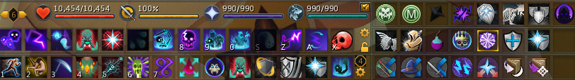

> **Ability Placement**
> - The script dynamically adapts rotations based on available abilities
> - Having all abilities on your action bar ensures optimal DPS and defense
> - Missing abilities may result in suboptimal rotation and slower kill times
>

<strong>Gear & Inventory Setup</strong>

> **T95 Gear Setup**

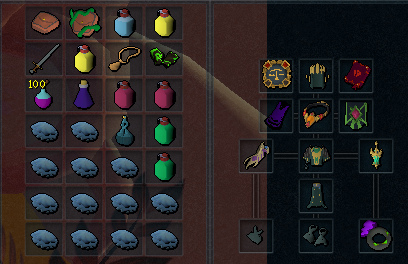

> **T90 Gear Setup**

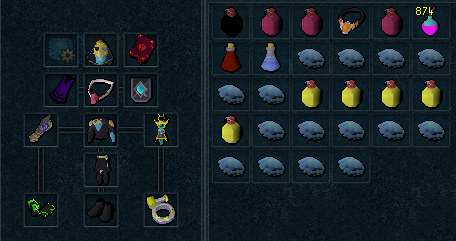

> **Pre-Fight Inventory**

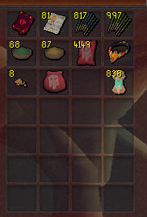
> - Script will use any enabled or available items in the pre-fight preset, and it will refill divine charges, scripture and eof if low.

> **Banking Preset Contents**
> - Overload potion (any tier)
> - Weapon Poison potion (preferably +++)
> - Food: Blubbers or any best available (may impact kill time due to adrenaline drain)
> - Saradomin brews/Guthix rest (optional, recommended with lower gear tier)
> - Restore/Prayer potions
> - Necromancy runes (inventory or Nexus)
> - Rune pouches with:
    >   - Vengeance runes (if enabled)
>   - Smoke Cloud runes (if enabled)
>   - Disruption Shield runes (if enabled)
>   - Spellbook Swap runes (if using multiple spellbooks)

<strong>Script Settings Configuration</strong>

> **General Settings**
>
> 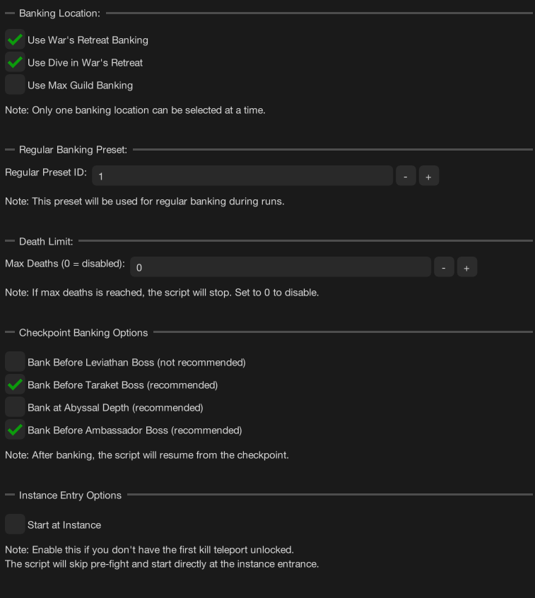
>
> Configure banking location (War's Retreat or Max Guild), checkpoint banking options, and instance entry preferences.

> **Pre-Fight Settings**
>
> 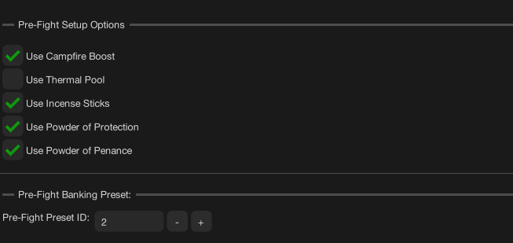
>
> Enable campfire boost, thermal pool, incense sticks, and powder buffs for optimal preparation.

> **Aura Settings**
>
> 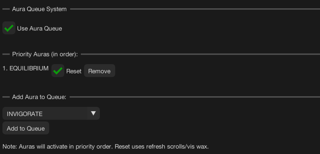
>
> Configure aura queue system with priority ordering and automatic reset options.

> **Familiar Settings**
>
> 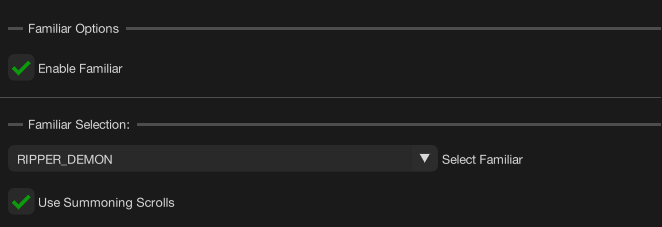
>
> Select familiar type and enable scroll usage for additional DPS support (recommended ripper demon).

> **Prayer Settings**
>
> 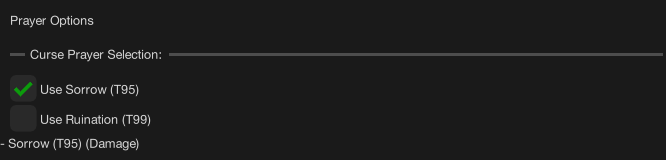
>
> Choose between Sorrow (T95) or Ruination (T99) curse prayers.

> **Abilities Settings**
>
> 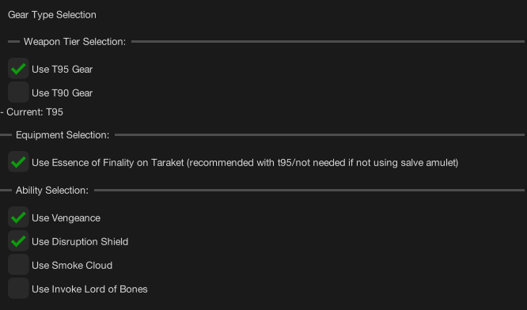
>
> Configure gear tier (T90/T95), EOF usage, and special ability toggles (Vengeance, Disruption Shield, Smoke Cloud, Invoke Lord of Bones).

> **Dungeon Settings**
>
> 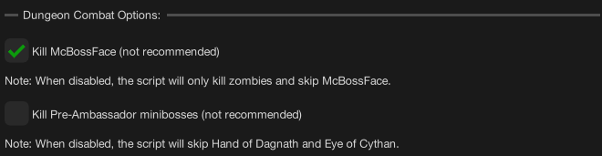
>
> Toggle optional miniboss kills (McBossFace, Pre-Ambassador minibosses).
> 
> > **Consumable Settings**
>
> 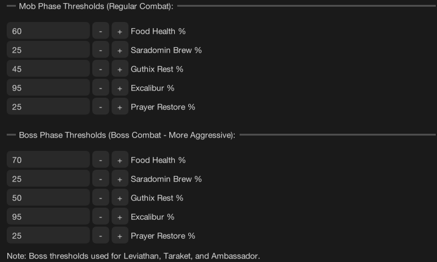
>
> Adjust healing options for regular mobs and bosses.

> Note that this a very big script and unexpected things can still happen. For any issues please report them to correct discord thread.

</ContentBlock>

:::hidden

## Changelog

:::

<Changelog changes={changes} />