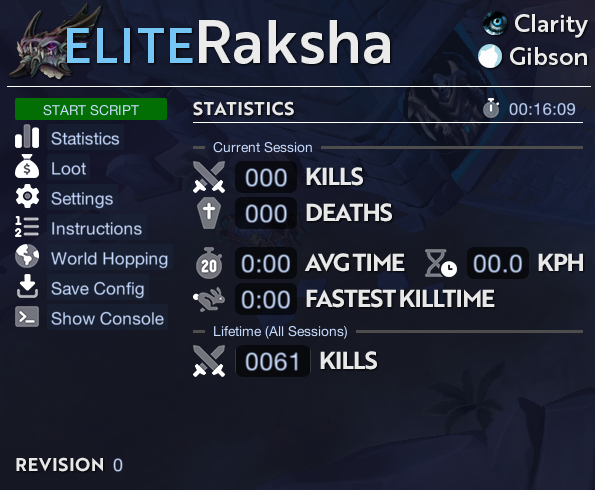
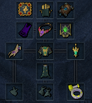
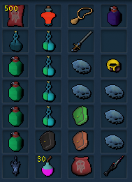
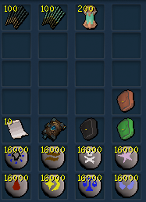

import React from 'react';
import TopBanner from '@site/src/components/TopBanner';
import ContentBlock from '@site/src/components/ContentBlock';
import Changelog from '@site/src/components/Changelog';
import BrowserWindow from '@site/src/components/BrowserWindow';
import changes from './changes.json'

<TopBanner title="EliteRaksha" version="v1.0.0" author="Clarity & Gibson" skill="Necromancy">
</TopBanner>

:::hidden

## Cost

:::

<ContentBlock title="Cost">
> - $75 USD / month (not including client access).
:::danger Limitations
- This script has **very high** requirements, ensure you meet them before purchasing.
   - Contact **Clarity** or **Gibson** if you have questions about whether your account(s) meet the criteria.
:::
</ContentBlock>

:::hidden

## Features

:::

<ContentBlock title="Features">
> - Kills Raksha, the Shadow Colossus.
> - Performs tick-perfect combat rotations for fast and efficient kills.
> - Upkeeps all necessary buffs and potion effects.
> - Intelligent banking, which performs the following tasks when required via bonfire preset:
>    - Replenishes Lantadyme/Spirit Weed incense stick effects.
>    - Adds torn pages to Erethdor's grimoire.
>    - Adds divine charges to your charge pack.
>    - Places runes inside your rune pouches.
>    - Resets sign of life cooldown via reset scrolls (although signs/deaths should never occur).
>    - Renews familiar and refills familiar special scrolls.
>    - Resets Invigorate aura via aura resets.
> - Professional UI (see screenshot below) which contains the following:
>    - Fully customizable settings.
>    - Statistics display showing kills, kills per hour, average killtime, fastest killtime, and lifetime kills.
>    - Loot tracker with total GP earned and GP/hour calculations.
>    - Custom debugging console with colored indicators.
>    - Config saving and automatic loading.
> - Customizable world-hopping functionality.

<strong>Statistics UI</strong>

</ContentBlock>

:::hidden

## Requirements

:::

<ContentBlock title="Requirements">

> **Worn Equipment**
> - Crown of the First Necromancer
> - Robe top of the First Necromancer (Biting 4 | Relentless 5 + Crackling 4) (PERKS REQUIRED)
> - Robe bottom of the First Necromancer (Impatient 4 | Invigorating 4 + Mobile) (PERKS REQUIRED)
> - Hand wrap of the First Necromancer
> - Foot wraps of the First Necromancer
> - Essence of Finality amulet (Deathguard Special stored)
> - Reaver's Ring
> - Igneous Kal-Zuk (Kal-Mor is fine)
> - Omni guard (Aftershock 4 + Eruptive 2) (PERKS REQUIRED)
> - Soulbound Lantern (Precise 6 + Aftershock 1) (PERKS REQUIRED)
> - Zemouregal's Nexus or Deathwarden Nexus (Make sure you have 25k of each rune and Ectoplasm)
> - Supreme Invigorate aura unlocked
> - Erethdor's Grimoire

> **Inventory**
> - Elder overload potion (6)
> - Adrenaline renewal flask (6)
> - Powerburst of vitality (4)
> - x10 Vulnerability Bombs
> - Weapon poison +++ flask (6)
> - x4 Spiritual Prayer potion (6)
> - Expensive spices
> - Binding contract (Ripper demon)
> - x500 Ripper Demon scrolls (Death from Above)
> - Grasping Rune Pouch (Red) (Death | Chaos | Law | Cosmic)
> - Grasping Rune Pouch (Blue) (Earth | Air | Water | Fire)
> - Grasping Rune Pouch (Black) (Blood | Astral | Body | Soul)
> - Enhanced Excalibur
> - Soulbound Lantern (Flanking 4) (PERK REQUIRED)
> - Any magic wand of your choice
> - Hazelmere's Signet Ring or Luck of the dwarves
> - x4 Guthix rest flask (6)
> - x5 Blue Blubber Jellyfish
>    - Can adjust rest/jellyfish amount as desired

> **Archaeology Relics**
> - Conservation of Energy
> - Berserker's Fury

> **Passive Unlocks**
> - Passive Ring of Vigour (required)
> - T100 Omni Guard and Soulbound Lantern (Shard of Genesis Unlock) (required)

</ContentBlock>
<ContentBlock title="Abilities, Items, & Spells">

> **Abilities & Spells  (All of these are required on the action bar)**
> - Death Skulls
> - Living Death
> - Volley of Souls
> - Command Skeleton Warrior
> - Command Vengeful Ghost
> - Command Putrid Zombie
> - Necromancy (Basic Attack)
> - Touch of Death
> - Finger of Death
> - Split Soul
> - Conjure Undead Army
> - Soul Sap
> - Soul Strike
> - Death Essence (Omni-Guard Special Attack)
> - Darkness 
> - Invoke Death
> - Threads of Fate
> - Life Transfer
> - Deathguard Special Attack (in EoF)
> - Essence of Finality Special Attack (Ability)
> - Vengeance
> - Spellbook Swap (Ancient)
> - Smoke Cloud
> - Surge
> - Dive
> - Vulnerability Bomb (target)
> - Blue Blubber Jellyfish
> - Guthix Rest flask (6)
> - Enhanced Excalibur
> - Ingenuity of Humans

</ContentBlock>

<ContentBlock title="Miscellaneous Requirements">

> - Make sure you have Necromancy auto-attack turned off in combat settings
> - Make sure you're using Full Manual (not revolution)
> - Make sure you have auto-retaliate turned off
> - Make sure ability queuing is turned off

</ContentBlock>
<ContentBlock title="Quick Prayers">

> **Quick Prayers Setup (All of these are required on the action bar)**
> - Quick Prayers 1 (Soul Split + Ruination)
</ContentBlock>
:::hidden

## Setup

:::
<ContentBlock title="Setup">

<strong>Inventory & Equipment Setup</strong>

- **Ripper scroll autofire set to 1.**

<strong>Bonfire Preset</strong>

</ContentBlock>

:::hidden

## Frequently Asked Questions

:::

<ContentBlock title="Frequently Asked Questions">

> **Q1: The bot isn’t starting or freezes after launching.**  
> **Solution:** Check that you’ve met all equipment and inventory requirements. Missing a required item, action bar ability, or relics can cause the bot to stall, malfunction, die, or work incorrectly. Restart the bot after verifying your setup.

> **Q2: Bot stops unexpectedly or struggles to perform abilities.**  
> **Solution:** Ensure your in-game settings match the action bar and quick prayers setup. Any missing abilities or misconfigured action bar items will impact the bot’s effectiveness.

> **Q3: No DPS increase despite having the recommended gear.**  
> **Solution:** Ensure your Archaeology Relics, and passives are correctly equipped. Conservation of Energy, and Berserker's Fury are required to meet DPS checks. If possible, ensure Reaper Crew is unlocked for maximum DPS.

> **Q4: I am missing certain item requirements. Can the bot work without them?**  
> **Solution:** The bot is optimized for the listed setup. While you can experiment, performance or stability issues may arise without the full list of equipment and unlocks.

> **Q5: The bot is not using Vulnerability Bombs properly or not at all.**  
> **Solution:** Double-check that Vulnerability Bombs are in your inventory and mapped to the action bar. Also, confirm that auto-retaliate is off, as it can interfere with some timed abilities.

> **Q6: Error related to missing runes or runes not being used.**  
> **Solution:** Make sure the Grasping Rune Pouches contain the required runes and that you have at least 16,000 of each in them to ensure an ample amount of time for runs. Errors and deaths can also occur if you accidentally deplete any essential runes mid-run.

> **Q7: Bot doesn’t seem to be summoning Ripper Demon or using Death from Above.**  
> **Solution:** Ensure that both Binding Contracts and Ripper Demon scrolls are available in your inventory.

> **Q8: Bot doesn’t trigger the Deathguard Special Attack.**  
> **Solution:** Make sure the Essence of Finality Special Attack (Ability) is on the action bar. It’s needed for the Deathguard Special Attack to activate as expected.

> **Q9: The bot’s Quick Prayers aren’t activating as configured.**  
> **Solution:** Review your Quick Prayer setup in-game to ensure the combinations of Soul Split and Ruination are mapped as shown. Additionally, make sure you drag quick prayers from the setup menu onto your action bar.

</ContentBlock>

:::hidden

## Changelog

:::

<Changelog changes={changes}>

</Changelog>

