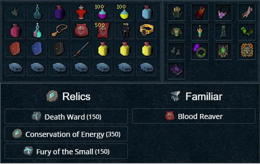
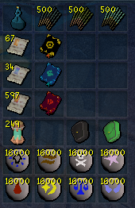

import React from 'react';
import TopBanner from '@site/src/components/TopBanner';
import ContentBlock from '@site/src/components/ContentBlock';
import Changelog from '@site/src/components/Changelog';
import BrowserWindow from '@site/src/components/BrowserWindow';
import changes from './changes.json'

<TopBanner title="EliteTelos 4K" version="v1.0" author="ClarityAndGibson" skill="Necromancy">
</TopBanner>

:::hidden

## Cost

:::

<ContentBlock title="Cost">
> - $250 USD / Month (not including client access). Limited slots. Two sessions per user.
:::danger Limitations
- **Be aware, This boss require very good gear and high requirements, deaths can still happen**
:::
</ContentBlock>

:::hidden

## Frequently Asked Questions

:::

<ContentBlock title="Frequently Asked Questions">

> **Q1: The bot isn’t starting or freezes after launching.**  
> **Solution:** Check that you’ve met all equipment and inventory requirements. Missing a required item, action bar ability, or relics can cause the bot to stall, malfunction, die, or work incorrectly. Restart the bot after verifying your setup.

> **Q2: Bot stops unexpectedly or struggles to perform abilities.**  
> **Solution:** Ensure your in-game settings match the action bar and quick prayers setup. Any missing abilities or misconfigured action bar items will impact the bot’s effectiveness.

> **Q3: The bot isn’t using certain defensive abilities as expected.**  
> **Solution:** Verify that all defensives are placed on your action bar. Missing even one defensive on the bar can interrupt bot behavior, leading to death in-game.

> **Q4: No DPS increase despite having the recommended gear.**  
> **Solution:** Ensure your Archaeology Relics, Passives, and Farming totem perks are correctly equipped. Death Ward, Conservation of Energy, and Fury of the Small are required to meet DPS checks. If possible, ensure Reaper Crew is unlocked for maximum DPS.

> **Q5: I am missing certain item requirements. Can the bot work without them?**  
> **Solution:** The bot is optimized for the listed setup. While you can experiment, performance or stability issues may arise without the full list of equipment and unlocks.

> **Q6: The bot is not using Vulnerability Bombs properly or not at all.**  
> **Solution:** Double-check that Vulnerability Bombs are in your inventory and mapped to the action bar. Also, confirm that auto-retaliate is off, as it can interfere with some timed abilities.

> **Q7: Error related to missing runes or runes not being used.**  
> **Solution:** Make sure the Grasping Rune Pouches contain the required runes and that you have at least 16,000 of each in them to ensure an ample amount of time for runs. Errors and deaths can also occur if you accidentally deplete any essential runes mid-run.

> **Q8: Bot doesn’t seem to be summoning Blood Reaver or using Blood Siphon.**  
> **Solution:** Ensure that both Binding Contracts and Blood Reaver scrolls are available in your inventory.

> **Q9: Defensive abilities seem mistimed, leading to more deaths.**  
> **Solution:** Double-check that the Anachronia Totem Perk Armored is active. This boosts Barricade duration, essential for tanking Telos’s hits. Also, confirm that all aforementioned defensive abilities are on your action bar.

> **Q10: Bot doesn’t trigger the Deathguard Special Attack.**  
> **Solution:** Make sure the Essence of Finality Special Attack (Ability) is on the action bar. It’s needed for the Deathguard Special Attack to activate as expected.

> **Q11: The bot’s Quick Prayers aren’t activating as configured.**  
> **Solution:** Review your Quick Prayer setup in-game to ensure the combinations of Soul Split, Deflect Melee, Deflect Mage, and Ruination are mapped as shown. Incorrect settings will disrupt the prayer-switching mechanics. Additionally, make sure you drag quick prayers from the setup menu onto your action bar.

</ContentBlock>

:::hidden

## Requirements

:::
<ContentBlock title="Requirements">

> **Worn Equipment**
> - Crown of the First Necromancer
> - Robe top of the First Necromancer (Enhanced Devoted 4 | Relentless 5 + Crackling 4) (PERKS REQUIRED)
> - Robe bottom of the First Necromancer (Devoted 4 + Impatient 4 | Invigorating 4 + Mobile) (PERKS REQUIRED)
> - Cinderbane gloves
> - Foot wraps of the First Necromancer
> - Essence of Finality amulet (Deathguard Special stored)
> - Zorgoth's Ring
> - Igneous Kal-Zuk (Kal-Mor is fine)
> - Omni guard (Aftershock 4 + Eruptive 2) (PERKS REQUIRED)
> - Soulbound Lantern (Precise 6 + Aftershock 1) (PERKS REQUIRED)
> - Zemoregal's Nexus or Deathwarden Nexus (Make sure you have 25k of each rune and Ectoplasm)
> - Equilibrium Aura unlocked
> - Underworld Grimoire 4
</ContentBlock>
<ContentBlock title="Inventory">

> **Inventory**
> - Hand wrap of the First Necromancer
> - Elder overload potion (6)
> - Adrenaline renewal flask (6)
> - Powerburst of vitality (4)
> - x10 Vulnerability Bombs
> - x10 Sticky Bombs
> - Weapon poison +++ flask (6)
> - Super restore flask (6)
> - Super prayer renewal potion (6)
> - Expensive spices
> - Binding contract (Blood Reaver)
> - x500 Blood Reaver scroll (Blood Siphon)
> - Deathwarden robe bottom (Any Tier) (Turtling 4 | Clearheaded 4) (REQUIRED)
> - Ring of Death
> - Grasping Rune Pouch (Red) (Death | Chaos | Law Cosmic)
> - Grasping Rune Pouch (Blue) (Earth | Air | Water | Fire)
> - Grasping Rune Pouch (Black) (Blood | Astral | Body | Soul)
> - Enhanced Excalibur
> - x3 Saradomin brew flask (6)
> - x7 Blue Blubber Jellyfish

</ContentBlock>
<ContentBlock title="Archaeology">

> **Archaeology Relics**
> - Death Ward
> - Conservation of Energy
> - Fury of the Small
</ContentBlock>
<ContentBlock title="Passive Unlocks">

> **Passive Unlocks (required)**
> - Passive Ring of Vigour
> - T100 Omni Guard and Soulbound Lantern (Shard of Genesis Unlock)
> - Reaper Crew (Not required but you will possibly experience some deaths for not passing DPS checks to phase Telos before certain mechanics as this adds extra damage bonus)
> - Anachronia Farm Unlocked Totem Perk: Armored (Increases the duration of Barricade by 3 ticks, i.e. 1.8 seconds (6 ticks, i.e. 3.6 seconds).)
</ContentBlock>
<ContentBlock title="Passive Unlocks">

> **Action Bar  (All of these are required on the action bar)**
> - Death Skulls
> - Living Death
> - Volley of Souls
> - Summon/Command Skeleton Warrior
> - Summon/Command Vengeful Ghost
> - Necromancy (Basic Attack)
> - Touch of Death
> - Finger of Death
> - Split Soul
> - Conjure Undead Army
> - Soul Sap
> - Soul Strike
> - Deathguard Special Attack
> - Death Essence (Omni-Guard Special Attack)
> - Darkness 
> - Invoke Death
> - Blood Siphon
> - Threads of Fate
> - Life Transfer
> - Essence of Finality Special Attack (Ability)
</ContentBlock>
<ContentBlock title="Passive Unlocks">

> **Defensives (All of these are required on the action bar)**
> - Barricade
> - Preparation
> - Reflect
> - Disruption Shield
> - Devotion
> - Divert
> - Greater Bone Shield
> - Natural Instinct
> - Resonance
> - Freedom
> - Debilitate
> - Anticipation
> - Invoke Lord of Bones (optional if not 100% accurate)
> - Vengeance
> - Spellbook Swap (Lunar)
</ContentBlock>
<ContentBlock title="Misc">

> **Misc & Info (All of these are required on the action bar)**
> - Surge
> - Dive
> - Prism of Restoration
> - Vuln Bomb
> - Blue Blubber Jellyfish
> - Saradomin Brew Flask (6)
> - Enhanced Excalibur
> - Make sure you have Necromancy auto-attack turned off in combat settings
> - Make sure you're using Full Manual (Not revolution)
> - Make sure you have auto-retaliate turned off
> - Make sure ability queuing is turned off
</ContentBlock>
<ContentBlock title="Quick Prayers">

> **Quick Prayers Setup (All of these are required on the action bar)**
> - Quick Prayers 1 (Soul Split + Ruination)
> - Quick Prayers 2 (Deflect Melee + Ruination)
> - Quick Prayers 3 (Deflect Mage + Ruination)
</ContentBlock>
:::hidden

## Setup

:::
<ContentBlock title="Setup">

<strong>Inventory & Equipment Setup</strong>

- **Reaver scroll autofire set to 6-8 depending on enrage.**

<strong>Bonfire Preset</strong>

</ContentBlock>

:::hidden

## Changelog

:::

<Changelog changes={changes}>

</Changelog>