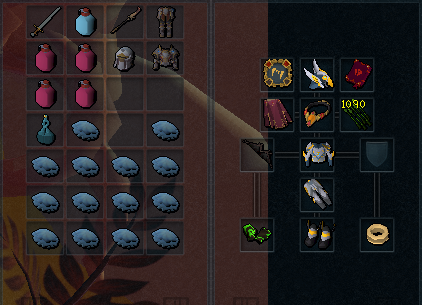

import React from 'react';
import TopBanner from '@site/src/components/TopBanner';
import ContentBlock from '@site/src/components/ContentBlock';
import Changelog from '@site/src/components/Changelog';
import BrowserWindow from '@site/src/components/BrowserWindow';
import changes from './changes.json'

<TopBanner title="FightKilnWithUs" version="v1.0" author="BotWithUs" skill="Strength">
</TopBanner>

:::hidden

## Cost

:::

<ContentBlock title="Cost">
> - **5 USD / weekly** (client access not included)
</ContentBlock>

:::hidden

## Features

:::

<ContentBlock title="Features">

> - **Combat Style**: All styles supported
> - **Banking Options**: War's Retreat or Max Guild banking
> - **Prayers**: Curse prayers
> - **Scripture Support**: Ful, Wen, Jas, Grimoire - automatic refilling
> - **Aura System**: Queue-based aura rotation with automatic reset support
> - **Consumables**: Overloads, Restore potions, Saradomin brews, Guthix rest, Excalibur
> - **Average Completion**: 20-40 minutes depending on gear tier
> - **Flexible Start**: Begin at War's Retreat portal, Max Guild, or instance entrance
> - **Gear Refill**: Automatic scripture, divine charge, and EOF recharging
> - **Pre-Fight Setup**: Campfire, thermal pool, incense sticks, powders support
    </ContentBlock>

:::hidden

## Requirements

:::
<ContentBlock title="Essential Requirements">

> **Game Settings**
> - Action Bar: Full Revolution mode
> - Ability Queuing: Not used
> - Auto Attacks: Enabled
> - Auto Retaliate: Disabled
>
> **Action Bar Setup**
> - Deflect prayers (curses) + Soul split
> - War's Retreat or Max Guild teleport if not starting at instance and if you are farming onyx
> - Auto switch configured in game settings to correct revolution bar depending on the equipped weapon
>
> **War's Retreat Setup**
> - War's Altar access (prayer restoration)
> - Adrenaline crystal access
> - Boss portal configured to Har-Aken
>
> **Inventory Items**
> - Food (preferably Blubbers&Sailfish/Rocktails)
> - Overload potions (any tier)
> - Restore/Prayer potions
> - Necromancy runes (inventory or Nexus), Magic runes(inventory or pouch)
>
> **Equipment**
> - Primary gear recommended t80+ and any melee gear swap preferably at least t70 regardless of primary style used
>
> **Alternative Start**
> - If starting at instance entrance without war's/max guild requirements enable start at instance in general settings (not usable if you are farming onyx)
    </ContentBlock>

<ContentBlock title="Recommended for Optimal Performance">

> **Equipment**
> - T95 or T90 gear for the primary style
> - Essence of Finality
> - Cinderbane Gloves (poison damage)
> - Scripture (Ful/Wen/Jas/Grimoire)
>
> **Consumables**
> - Weapon Poison+++
> - Powder of Protection
> - Powder of Penance
> - Lantadyme and Kwuarm Incense sticks

</ContentBlock>
:::hidden

## Setup

:::
<ContentBlock title="Setup Guide">

<strong>Action Bar Configuration</strong>

> **Ability Placement**
> - Uses full revolution combat configure your revolution bars how you want or as per the RS3 wiki revo bar setup

<strong>Gear & Inventory Setup</strong>

> **Example Gear Setup**

> **Pre-Fight Inventory**

> - Script will use any enabled or available items in the pre-fight preset, and it will refill divine charges, scripture and eof if low

> **Banking Preset Contents**
> - Overload potion (any tier)
> - Weapon Poison potion (preferably +++)
> - Food: Blubbers or any best available (may impact kill time due to adrenaline drain)
> - Saradomin brews/Guthix rest (optional, recommended with lower gear tier)
> - Restore/Prayer potions
> - Necromancy runes (inventory or Nexus)
> - Rune pouches with runes for your offensive spells if primary is magic

> The script has been tested with t95 necro with an average completion time of ~23min. Armadyl T70 range power armor with t90 Nox bow competition time ~30min. Star bloom magic tank armor t90 and t90 Nox Staff ~40 min. 
> These are not a hard requirement, however based on the above testing it's safe to say the script will perform better/faster with a power armor and have higher chance of completion with gear of at least t80+ due to higher accuracy (more damage).

</ContentBlock>

:::hidden

## Changelog

:::

<Changelog changes={changes} />
