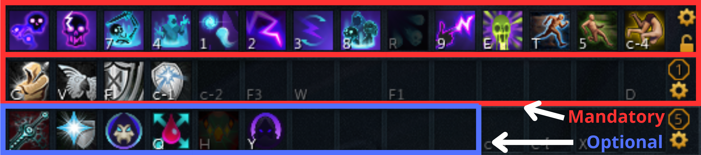
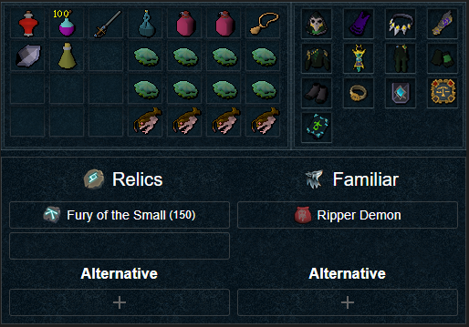
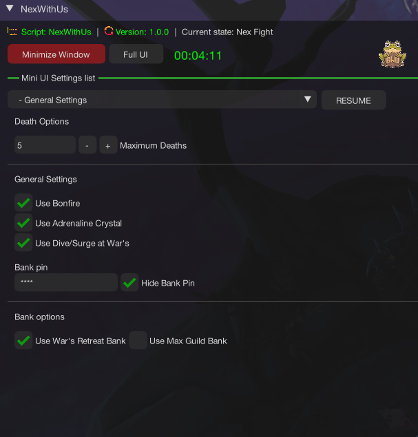
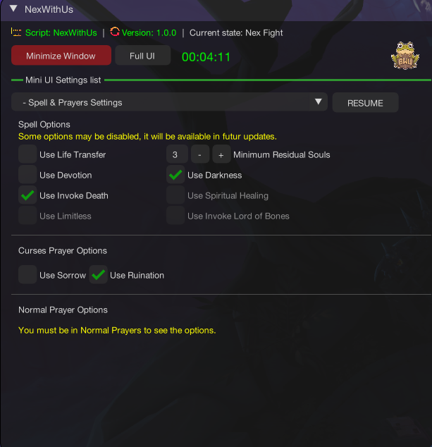
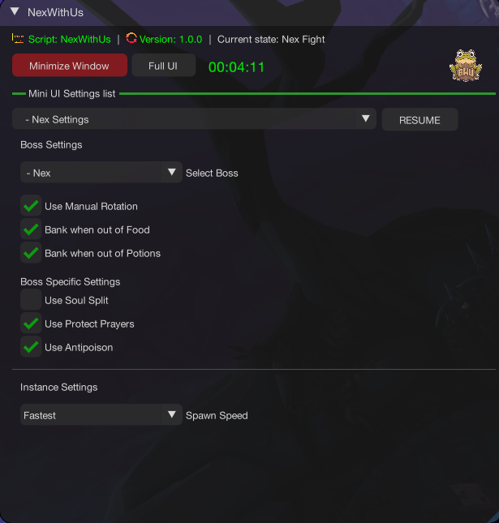

import React from 'react';
import TopBanner from '@site/src/components/TopBanner';
import ContentBlock from '@site/src/components/ContentBlock';
import Changelog from '@site/src/components/Changelog';
import BrowserWindow from '@site/src/components/BrowserWindow';
import changes from './changes.json'

<TopBanner title="NexWithUs " version="v1.0" author="Akisame" skill="Necromancy">
</TopBanner>

:::hidden

## Cost

:::

<ContentBlock title="Cost">
> - $20 USD / week (not including client access)
</ContentBlock>

:::hidden

## Features

:::

<ContentBlock title="Features">

> - **Hopping Worlds System**: You can setup a timer to hop worlds every X minutes, you also have the possibility to choose your region

> - **Loot BlackList System**: You can Blacklist any loot in Loots Settings.

> - **Bank pin**: You have the possibility to add your bank pin along with a hide pin option.

> - **Prayers**: Handle curses and normal prayers.

> - **Supported books**: Supported books are : Ful, Wen, Jas, Grimoire, Amascut.

> - **Usefull Items**: Excalibur and Ancient ritual shard, Vuln Bombs.

> - **Powders**: Powder of Penance / Powder of Protection are supported.

> - **Auras**: Aura rotation are supported along with a refresh aura potion.

> - **Familiars**: Supported familiars are, Hellhound / Blood Reaver / Ripper Demon / Kal'Gerion Demon. Scrolls are supported.

> - **Supported Potions**: All type of Overloads/Restores/Adrenaline/Saradomin brews are supported.

> - **Banking**: Banking at Wars and Max Guild.

> - **NotePaper**: Use note paper on Super restore and Saradomin brews

</ContentBlock>

:::hidden

## Requirements

:::
<ContentBlock title="Requirements">

> **Make sure you meet the requirements below**

:::danger Limitations
- **Be aware, Make sure you have Frozen Key or Achivement "Gielinor's Most Expensive Doorstop"**
:::
> - Foods / Overload / Restore / Saradomin Brew
> - Action Bar should be on full Manual
> - Ability Queuing off
> - Auto reliate off
> - Prayer tab should be open and visible
> - A minimum of 15,000 Divine charges is required (if using augmented gear)
> - A minimum of 500 of each necromancy runes and ectoplasm is required
> - War's Retreat Teleport/Max Guild
> - War's Altar
> - Boss portal set to a Boss (Left or Right)
</ContentBlock>
<ContentBlock title="Optional Requirements">

> **Having all Possible requirements ticked off will ensure a much better kill and result from this script**
> - Essence of Finality.
> - Weapon Special Attack.
> - Darkness.
> - Life Transfer.
> - Invoke Death.
> - Bonefire
> - Adrenaline Crystal

</ContentBlock>
:::hidden

## Setup

:::
<ContentBlock title="Setup">

<strong>Action Bar Setup</strong>

> - Please make sure all mandatory abilities are on your bar.
> - Please make sure all optional abilities are on your bar if options are checked.

<strong>Inventory Setup</strong>

> **T70 Gear Setup, Ofc you can use better gear**

> *Make sure your preset contains the following...*
> - Any Overload potion.
> - Any Antipoison potion.
> - Powerburst of Vitality.
> - Saradomin Brews and Food.
> - Restores potions.
> - Necromancy runes, in your inventory or in your Nexus

<strong>Settings Setup</strong>

> **General Settings**

> **Equipment Settings**

> **Spells And Prayers Settings**

> **NexWithUs Settings**

</ContentBlock>

:::hidden

## Changelog

:::

<Changelog changes={changes}>

</Changelog>
