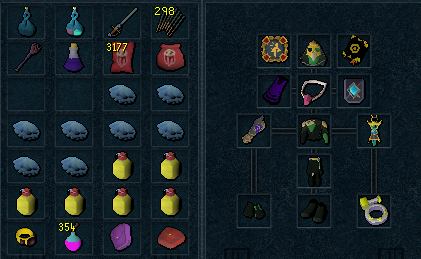
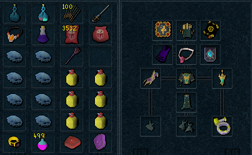
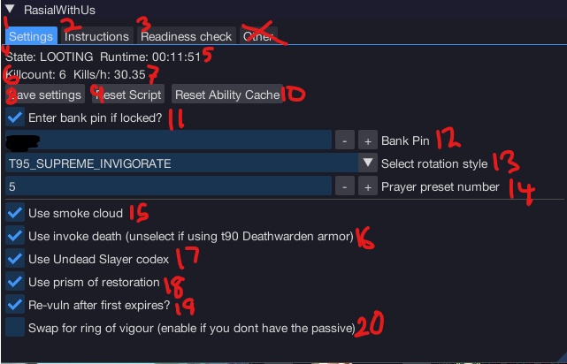

import React from 'react';
import TopBanner from '@site/src/components/TopBanner';
import ContentBlock from '@site/src/components/ContentBlock';
import Changelog from '@site/src/components/Changelog';
import BrowserWindow from '@site/src/components/BrowserWindow';
import changes from './changes.json'

<TopBanner title="RasialWithUs" version="v2.0.0" author="BotWithUs" offical="OFFICAL SCRIPT" skill="Necromancy" >
</TopBanner>

:::hidden

## Cost

:::

<ContentBlock title="Cost">

> - $100 USD / month (not including client access)

</ContentBlock>

:::hidden

## Features

:::

<ContentBlock title="Features">

> - Fights Rasial fully autonomously, all you need to do is make sure the bot has enough supplies.
> - Supports all 3 rotations on PVME for rasial: T95 Supreme invigorate (1:10-1:20 killtimes), T95 Equilbrium (1:15-1:30 killtimes), T90 Equilibrium (1:30-1:50 killtimes). 
> - Picks up drops, rinse and repeat.
> - Has a number of safety mechanisms to lobby when the player is out of critical resources like item charge, runes, etc.
> - Makes you a TON of gp!
> - Currently ~65m / hr on average

</ContentBlock>

:::hidden

## Requirements

:::
<ContentBlock title="Requirements">

Any items marked as recommended are optional, anything else is a strict requirement.

Required by all rotations
> - Ancient summoning unlocked for blood reaver or hellhound, scrolls if using reaver.
> - 99+ Necromancy and all necromancy abilities and incantations unlocked from the well of Souls
> - Invigorating 4 perk required
> - Igneous Kal-Mor cape or Igneous Kal-Ket cape
> - At least 87 herblore for Super adrenaline potions
> - Haunted mine Quest + enchanted salve amulet
> - Alpha vs Omega quest complete to fight Rasial
> - Ring of vigour unlocked, and ideally made passive via Extinction request (not required, bot can vigour switch)
> - 118 archaeology for Conservation of Energy (boost from 110) OR Supreme Invigorate + plenty of refreshes. Ideally both.
> - Guildmaster certification recommended, depends on which rotation used.
> - Runes in pouches for the spells you want to use (Prism of restoration, smoke cloud, invoke death)
> - (Strongly Recommended): 300-400m+ to buy sufficient supplies for running all day
> - (Strongly Recommended): Undead slayer perk on gear
> - (Strongly Recommended): Vulnerability bombs
> - (Recommended): Luck ring switch

T95 Invigorate Rotation
> - Level 115 herblore for adrenaline renewal potions
> - Supreme invigorate Aura + plenty of Tier4 refreshs (Requires Supreme invigorate 24/7)
> - EOF with Death Grasp stored

T95 Equilibrium (with Conservation of Energy)
> - Divert
> - EOF with Death Grasp stored
> - (Recommended) Level 115 herblore for adrenaline renewal potions
>
> Without CoE:
> - Supreme invigorate Aura + plenty of Tier4 refreshs (Requires Supreme invigorate 24/7)

T90 Equilibrium (with Conservation of Energy)
> - Divert
> - (Recommended) Level 115 herblore for adrenaline renewal potions
>
> Without CoE:
> - Supreme invigorate Aura + plenty of Tier4 refreshs (Requires Supreme invigorate 24/7)

</ContentBlock>

:::hidden

## Setup

:::
<ContentBlock title="Setup">

T90 Preset Setup example

Brews flasks can be replaced with:

- Super Guthix Brew flasks (BIS - "Best in slot")
- Super Guthix rest flasks
- Super Saradomin Brew Flasks

T95 Preset Setup example

Brews flasks can be replaced with:

- Super Guthix Brew flasks (BIS - "Best in slot")
- Super Guthix rest flasks
- Super Saradomin Brew Flasks

UI Settings Guide

This is an example of a possible T90 UI setup.

All recommended settings are optional, but lead to dps increase or qol increase. Use them if you can.

1. The settings tab, where you control how the script behaves.
2. Instructions tab, make sure to read these before you claim the script isnt working.
3. Readiness check, here you can run a test to help you determine if you're setup properly for the rotation you've selected.
4. Bot state, mostly informational about what the bot is thinking.
5. Runtime, how long since the script was loaded.
6. Killcount for the session
7. Kills per hour of the session
8. This button will remember your current settings in the UI the next time you launch the script.
9. Reset script. You may need to do this is the bot is not behaving correctly. Resets state to: WARS
10. Reset ability cache - Makes the script redetect your abilities. Run this if you change your action bars after loading the script.
11. Enable if you want the script to put in your bank pin for you.
12. The pin to enter
13. The rotation style you'd like to fight rasial with.
14. The quick prayer preset that has your Necromancy dmg prayer and soulsplit configured. Make sure its also on your actionbar.
15. Whether you want to use smoke cloud on rasial. Recommended.
16. Whether you want to cast invoke death at the start of the fight. Enable it, unless you're wearing T90 deathdealer armor.
17. Whether you have undead slayer codex unlocked and want to use it in the fight. Recommended.
18. Cast prism of restoration to facilitate better reaver heals. Advised.
19. Use another vuln bomb after the first one expires after a minute.
20. Swap to ring of vigour in inventory when using ults. Required if no passive ring of vigour unlocked.

</ContentBlock>

:::hidden

## Changelog

:::

<Changelog changes={changes}>

</Changelog>
