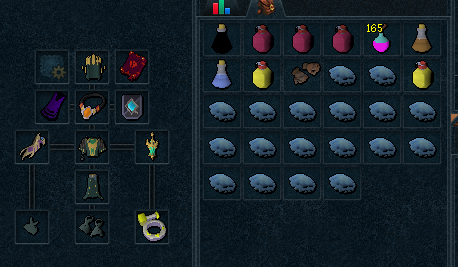
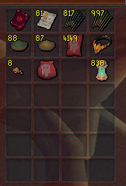
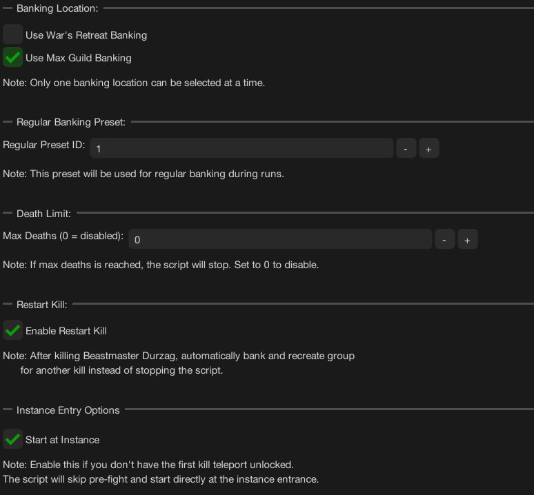
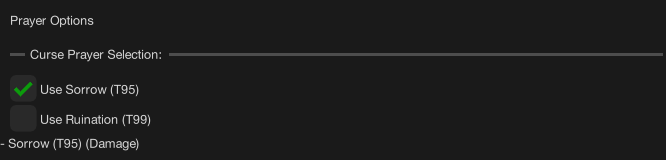

import React from 'react';
import TopBanner from '@site/src/components/TopBanner';
import ContentBlock from '@site/src/components/ContentBlock';
import Changelog from '@site/src/components/Changelog';
import BrowserWindow from '@site/src/components/BrowserWindow';
import changes from './changes.json'

<TopBanner title="ZukWithUsNM" version="v1.0" author="BotWithUs" skill="Necromancy">
</TopBanner>

:::hidden

## Cost

:::

<ContentBlock title="Cost">
> - **15 USD / weekly** (client access not included)
</ContentBlock>

:::hidden

## Features

:::

<ContentBlock title="Features">

> - **Combat Style**: Necromancy support with T90/T95
> - **Banking Options**: War's Retreat or Max Guild banking
> - **Prayers**: Curse prayer support (Sorrow T95 / Ruination T99)
> - **Scripture Support**: Ful, Wen, Jas, Grimoire - automatic refilling
> - **Aura System**: Queue-based aura rotation with automatic reset support
> - **Familiars**: Hellhound, Blood Reaver, Ripper Demon, Kal'Gerion Demon with scroll usage
> - **Consumables**: Overloads, Restore potions, Adrenaline, Saradomin brews, Guthix rest, Stamina and Energy potions
> - **Flexible Start**: Begin from bank or directly at instance entrance
> - **Gear Refill**: Automatic scripture, divine charge, and EOF recharging
> - **Pre-Fight Setup**: Campfire, thermal pool, incense sticks, powders support
</ContentBlock>

:::hidden

## Requirements

:::
<ContentBlock title="Essential Requirements">

> **Game Settings**
> - Script will perform initial requirement checks and log to console if something is configured incorrectly
> - Action Bar: Full Manual mode
> - Ability Queuing: Disabled
> - Auto Attacks: Disabled
> - Auto Retaliate: Disabled
> - Bone Shield spell: Active
>
> **Action Bar Setup**
> - Deflect prayers and Soul Split (curses)
> - War's Retreat or Max Guild teleport
> - Double Surge and Dive (works bes with Mobile perk or Shadow's Grace relic)
> - All necromancy abilities
> - Defensive abilities (Devotion, Reflect, Debilitate, Barricade, Darkness, Anticipation)
>
> **War's Retreat Setup**
> - War's Altar access (prayer restoration)
> - Adrenaline crystal access
> - Boss portal configured to TzKal-Zuk
>
> **Inventory Items**
> - Food (Blubbers and Saradomin brews)
> - Overload potions (any tier)
> - Restore/Prayer potions/Stamina or Energy flask
> - Necromancy runes (Nexus)
> - Energy flask or Stamina potion or use the salt-water treatment
>
> **Equipment**
> - T90/T95 necro
>
> **Start**
> - Configure your preferred start mode in General Settings (`Start at Instance` if required).
> - Ensure your selected presets are valid and loadable before running.
> - If using restart-from-checkpoint, enable it in General Settings.
>
</ContentBlock>

<ContentBlock title="Recommended for Optimal Performance">

> **Equipment**
> - T95 Necromancy gear
> - Essence of Finality
> - Scripture (Ful/Wen/Jas/Grimoire)
> - Excalibur
> **Abilities & Spells**
> - All Necromancy abilities unlocked
> - Vulnerability bombs (add to action bar, option 1: Default)
> **Familiar**
> - Hellhound
> **Consumables**
> - Weapon Poison+++
> - Powder of Protection
> - Powder of Penance
> - Lantadyme and Kwuarm Incense sticks

</ContentBlock>
:::hidden

## Setup

:::
<ContentBlock title="Setup Guide">

<strong>Action Bar Configuration</strong>

<strong>Gear & Inventory Setup</strong>

> **T95 Example Gear Setup**

> **T90 Example Gear Setup**

> **Pre-Fight Inventory**

> - Script will use any enabled or available items in the pre-fight preset, and it will refill divine charges, scripture and eof if low.

> **Banking Preset Contents**
> - Overload potion (any tier)
> - Weapon Poison potion (preferably +++)
> - Food: Blubbers or any best available (may impact kill time due to adrenaline drain)
> - Saradomin brews/Guthix rest (optional, recommended with lower gear tier)
> - Restore/Prayer potions
> - Necromancy runes (inventory or Nexus)
> - Rune pouches with:
>   - Runes for Prism of Restoration or enough scrolls for hellhound to heal

<strong>Script Settings Configuration</strong>

> **General Settings**
>
> 
>
> Configure banking location (War's Retreat or Max Guild), death limits, loot options, and instance entry preferences.

> **Pre-Fight Settings**
>
> 
>
> Enable campfire boost, thermal pool, incense sticks, and powder buffs for optimal preparation.

> **Aura Settings**
>
> 
>
> Configure aura queue system with priority ordering and automatic reset options.

> **Familiar Settings**
>
> 
>
> Select familiar type and enable scroll usage for additional survivability and DPS support.

> **Prayer Settings**
>
> 
>
> Choose curse and style prayer combinations based on your setup.

> **Abilities Settings**
>
> 
>
> Configure gear tier and ability behavior options.
>
> **Consumable Settings**
>
> 
>
> Adjust healing and prayer restore thresholds.

</ContentBlock>

:::hidden

## Changelog

:::

<Changelog changes={changes} />
