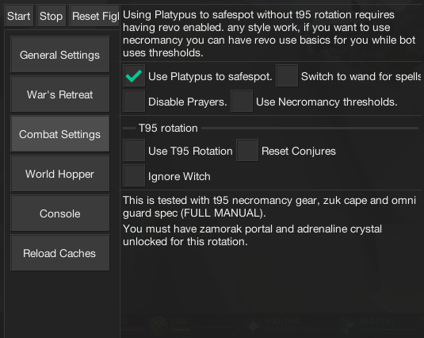
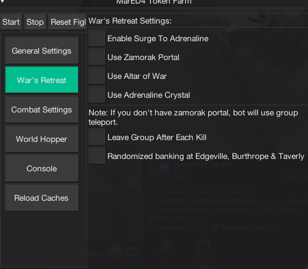

import React from 'react';
import TopBanner from '@site/src/components/TopBanner';
import ContentBlock from '@site/src/components/ContentBlock';
import Changelog from '@site/src/components/Changelog';
import BrowserWindow from '@site/src/components/BrowserWindow';
import changes from './changes.json'

<TopBanner title="MarED4" version="v1.0.0" author="MaryamK" offical="SCRIPT" skill="Necromancy">
</TopBanner>

:::hidden

## Cost

:::

<ContentBlock title="Cost">

> $13 / month (not including client access)

</ContentBlock>

:::hidden

## Features

:::

<ContentBlock title="Features">

- Farms DG tokens from ED4 Cerberus miniboss.
> - Supports:
> - Revolution++ (Magic, Range).
> - Revolution+ Necromancy Basics (uses thresholds and auto-attacks).
> - Full Manual Mode (optimized for T95 gear & Zuk cape).

> - Platypus safespotting to avoid Chaos Witch (recommended for low levels) - you need Bind spell (1 nature rune per cast). 
> - Suppports wand switch for spell casts. (only use if you have 0% accuracy).
> - Supports Curses & Normal Prayers.
> - Uses Solid Food, Brews, and Prayer Potions.
> - Death Handler to reclaim items and continue.
> - Group Teleport support if Zamorak isn't unlocked.
> - Re-create Group after each kill.
> - Banking after a configurable number of kills.
> - Randomized Banking - supports Edgeville, Burthrope and Taverly.
> - World Hopping to a specified region.
> - Data is persistent across sessions (auto-saved every 2 minutes).
    ## Optional
- Uses vulnerability bombs if in inventory.
- Disable Prayers once at safespot
- Uses Darkness.
- Reset Conjures after each kill.
- Uses Invoke Death (Recommended).
- Uses Eof (T90 Spec) if worn.
- Ignores Witch Healer (Recommended if you have vulns/eof enabled).
- Uses Ancient Elven Shard if in inventory.

</ContentBlock>

:::hidden

## T95 Requirements

:::
<ContentBlock title="T95 Requirements">

- T95 First Necromancy gear
- Omni Guard*
- Zuk Cape*
- Altar of War & Adrenaline Crystal Unlocked*
- Zamorak Wars Portal*
- Have the selected prayers on action bar

Please make sure you have enabled options and all of the mandatory abilities in your action bar

# ActionBar
> - Conjure Undead Army 
> - Command Vengeful Ghost
> - Soul Sap
> - Touch of Death
> - Death Skulls
> - Basic Attack
> - Bloat
> - Volley of Souls
> - Finger of Death
> - Weapon Special Attack (T95 Spec)
> - Essence of Finality (T90 Spec - can use t70 wep for same result)
> - Selected Prayers & Deflect Melee
> - Wars Retreat Teleport.
> - Surge

**If Enabled/Optional**
> - Invoke Death.
> - Vulnerability bombs.
> - Darkness.

Notes*: 
1. *Omni Guard* - Mandatory since the script uses spec rotation.
2. *Zuk Cape* - Required to maximize DPS.
3. This script utilizes wars altar and adrenaline crystal (ed4 portal is optional).

</ContentBlock>

:::hidden

## Low Level Methods

:::
<ContentBlock title="Low Level">

- If you are using Platypus method, ensure you have bind spell and nature runes in ur preset.
- Make sure platypus is summoned.
- If you are using necromancy, please make sure revo uses basics and conjures, and Use Thresholds Option is enabled.
- If you are NOT using necromancy, please make sure you are using revo++

# Action Bar
> - Selected Prayers & Deflect Melee
> - Surge.
> - Bind Spell
> - Appropriate abilities for your style.

</ContentBlock>

:::hidden

## FAQ

:::
<ContentBlock title="FAQ">

**Q1**: Does it support all combat styles?  
**A1**: Yes, the script supports all combat styles. For **Necromancy**, you can use **Revolution+** while letting the bot utilize thresholds. For other combat styles, you’ll need to enable **Revolution++**.

**Q2**: What are the requirements for the Platypus safespot?  
**A2**: You need to complete the quest *As a First Resort* to unlock the Platypus and have **Level 20 Magic** to cast the **Bind Spell** (requires 1 nature rune per cast).  

**Q3**: I’m splashing the Bind Spell cast. What can I do?  
**A3**: Enable the *Wand Switch* option in the script UI and ensure you have any **wand** in your inventory. This improves the accuracy of the spell.

**Q4**: Is there an alternative to War’s Retreat teleport for banking?  
**A4**: Yes! You can enable *Randomized Banking*, which supports Edgeville, Burthorpe, and Taverly banks.

**Q5**: Can I still use the script if I don’t have a Zamorak Portal?  
**A5**: Yes! The script will create a group and use **Group Teleport** to reach the desired location.

**Q6**: Why aren’t my added abilities being detected?  
**A6**: Abilities and prayers are cached when the script loads. If you add or change abilities, click the **Reload Cache** button to update the script.

**Q7**: Why isn’t the script eating food, even though I have some in my inventory?  
**A7**: Ensure you have the **Eat Food** ability in your action bar. If it’s missing, add it and click **Reload Cache** (refer to Q6).

</ContentBlock>

:::hidden

## Changelog

:::

<Changelog changes={changes}>

</Changelog>
