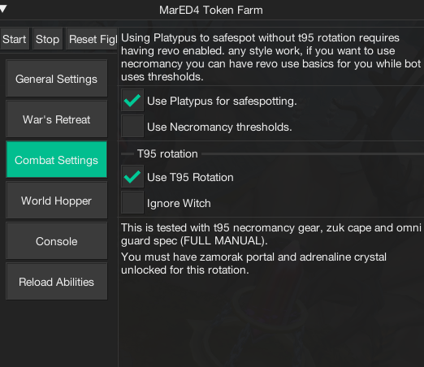

import React from 'react';
import TopBanner from '@site/src/components/TopBanner';
import ContentBlock from '@site/src/components/ContentBlock';
import Changelog from '@site/src/components/Changelog';
import BrowserWindow from '@site/src/components/BrowserWindow';
import changes from './changes.json'

<TopBanner title="MarED4" version="v1.0.6" author="MaryamK" offical="SCRIPT" skill="Necromancy">
</TopBanner>

:::hidden

## Cost

:::

<ContentBlock title="Cost">

> - $5 / month (not including client access)

</ContentBlock>

:::hidden

## Features

:::

<ContentBlock title="Features">

 - Farms dg tokens from ED4 Cerberus miniboss (235k avg dg tokens).
 - Bank After # kills.
 - Hop Worlds to specified region of your choosing.
 - Surges to Adrenaline Crystal (Optional) -- Only use if you have Mobile or double Surge
 - Drinks Overload (all types) if they are in the inventory.
 - Data is persistent across sessions (auto-saved every 2 minutes).
    ## Optional
- Uses vulnerability bombs if in inventory.
- Uses Darkness.
- Uses Invoke Death (Recommended).
- Uses Eof (T90 Spec) if worn.

</ContentBlock>

:::hidden

## Requirements

:::
<ContentBlock title="Requirements">

- T95 First Necromancy gear
- Omni Guard*
- Zuk Cape*
- Altar of War & Adrenaline Crystal Unlocked*
- Zamorak Wars Portal*
- Have Quick-Prayers 1 with either **Soul-Split or Deflect Magic + DPS prayer on Action Bar**.

Please make sure you have enabled options and all of the mandatory abilities in your action bar

Notes*: 
1. *T95 Gear* - Might be possible to do with t90 gear (haven't been tested though).
2. *Omni Guard* - Mandatory since the script uses spec rotation.
3. *Zuk Cape* - Required to maximize combat efficiency.
4. This script utilizes wars altar, portal and adrenaline crystal.
5. Ensure you have Zamorak, Lord of Chaos Portal.
6. You must have Quick-Prayer on Action bar as mentioned above.
</ContentBlock>

:::hidden

## Changelog

:::

<Changelog changes={changes}>

</Changelog>
