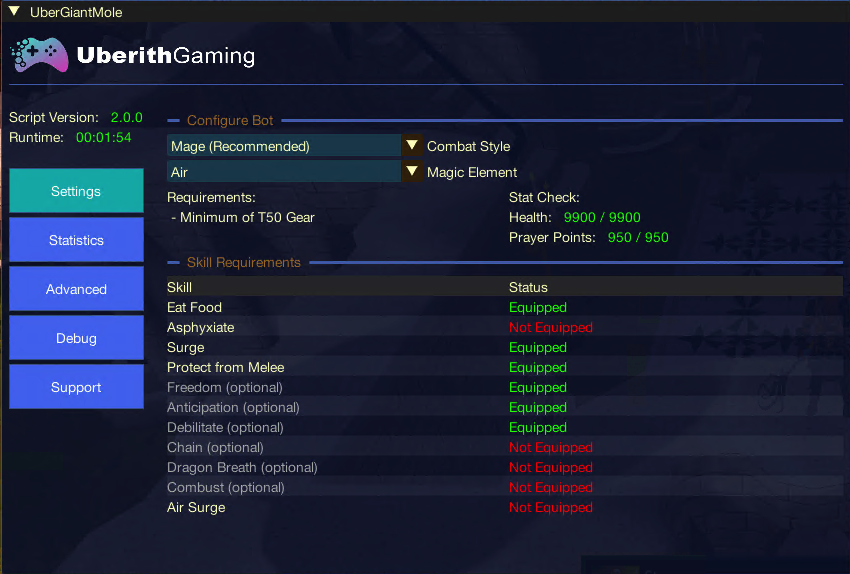
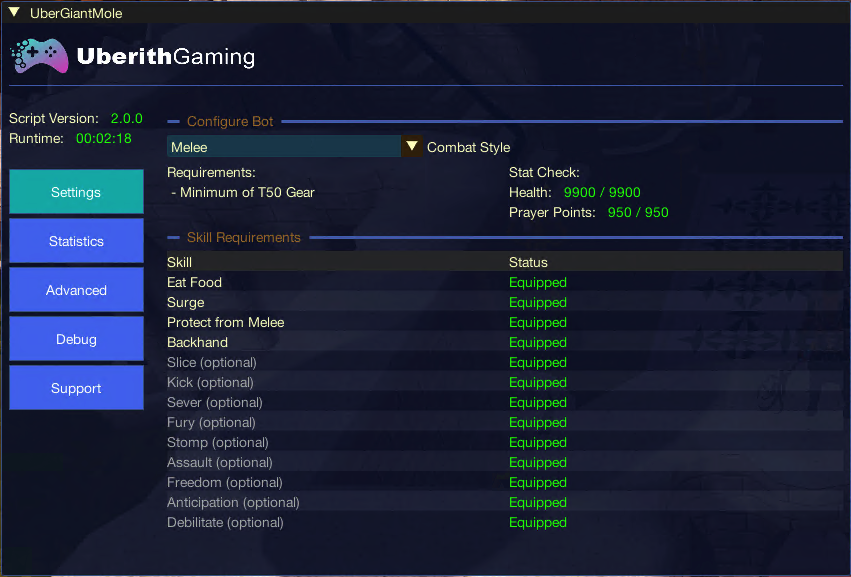
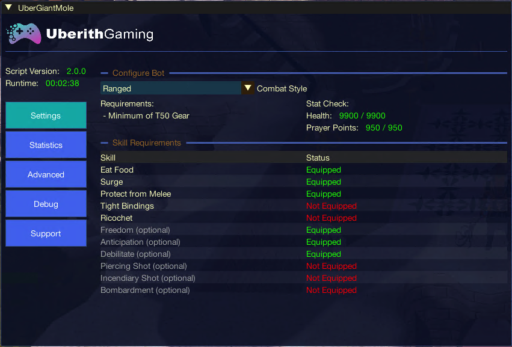

import React from 'react';
import TopBanner from '@site/src/components/TopBanner';
import ContentBlock from '@site/src/components/ContentBlock';
import Changelog from '@site/src/components/Changelog';
import BrowserWindow from '@site/src/components/BrowserWindow';
import changes from './changes.json';

<TopBanner 
  title="UberGiantMole" 
  version="v1.0.0" 
  author="Uberith" 
  skill="Necromancy" 
/>

<ContentBlock title="Cost">
> **$5 / week** *(client access not included)*
</ContentBlock>

<ContentBlock title="Features">

## 🐛 UberGiantMole – Automated Mole Slayer for RS3

Descend into the Falador Mole Lair with **UberGiantMole**, your combat automation companion for farming the Giant Mole. Whether you're grinding for pets, stacking skins and claws, or pushing passive profits — this script handles it all with precision and resilience.

---

### 🛡️ Supported Combat Styles:
- **Magic (Mage)**  
- **Melee**  
- **Ranged**

**Each style auto-configures essential abilities:**
- **Magic:** *Asphyxiate*, *Chain*, *Dragon Breath*, *Combust*, and elemental spells like *Air Strike*  
- **Melee:** *Slice*, *Kick*, *Backhand*, *Sever*, *Fury*, *Assault*  
- **Ranged:** *Piercing Shot*, *Ricochet*, *Incendiary Shot*, *Bombardment*, *Tight Bindings*

---

### ⚙️ Core Features:
- Automated Giant Mole encounter loop with safe, human-like combat cycles
- Smart healing system based on configurable health thresholds
- Support for defensive prayers like *Protect from Melee*
- Handles Mole burrows and movement patterns dynamically
- Auto-pickup and value-prioritized loot (Skins, Claws, GP)
- Full inventory banking and automatic re-entry
- World hopping if Mole instances are crowded

---

### 🖥️ GUI Examples

See how easy it is to configure your Giant Mole slayer sessions with UberGiantMole’s intuitive setup panels:

---

### ⏱ Session Tracking & Performance:
- Tracks kills, loot value, XP gains, and runtime
- Real-time display of GP earned and efficiency stats
- Optional drop logger by item type for detailed loot records

---

### 🧠 Smart Behavior:
- Auto-stop after configurable kill count, runtime, or GP value
- Randomized break handler for more human-like behavior
- Optional auto-logout on reaching session goals
- Adaptive repositioning when Mole burrows
- Tracks known Mole dig patterns for faster relocation

---

### 🧰 Requirements:
- **T50+ Combat Gear** recommended (higher for Hard Mode)
- Food (e.g., Rocktails) mapped to action bar for healing
- Action Bar setup including **Eat**, **Surge/Retreat**, and basic attacks
- **Mage:** Must have *Asphyxiate* and an attack spell available
- **Optional:** Defensive abilities like *Debilitate* or *Freedom* mapped

---

### 🚧 Known Limitations:
- Not optimized for low-level players or dangerous PvP zones
- Initial setup required: action bar mapping, gear loadout, and food

---

</ContentBlock>

<ContentBlock title="Changelog">
<Changelog changes={changes} />
</ContentBlock>
