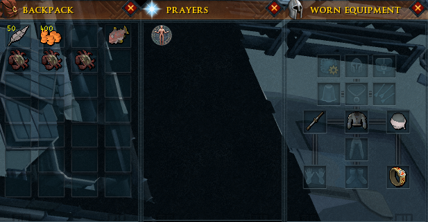
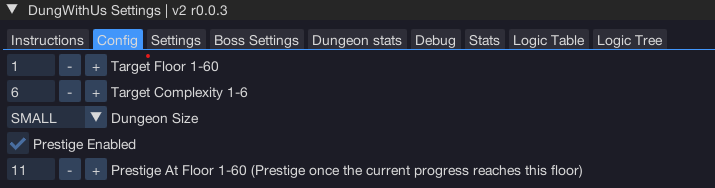
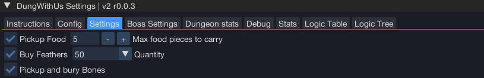

import React from 'react';
import TopBanner from '@site/src/components/TopBanner';
import ContentBlock from '@site/src/components/ContentBlock';
import Changelog from '@site/src/components/Changelog';
import BrowserWindow from '@site/src/components/BrowserWindow';
import changes from './changes.json'

<TopBanner title="DungWithUs" version="v2 r1.0.0" author="BotWithUs" skill="Dungeoneering">
</TopBanner>

<ContentBlock title="Features">

> - Supports all combat styles + swaps, recommended setup is to run magic > range > melee, if using melee recommend you bring a range/mage swap, if using range recommended any melee swap
> - Script can be reloaded mid dungeon and it will continue solving
> - Binding equipment must be done manually

</ContentBlock>

<ContentBlock title="Setup">

> **Initial Setup**
> - Start in demonheim
> - Prayer tab, equipment tab and backpack visible
> - Party interface window must be extended so all buttons are visible once open

<strong>GUI Configuration</strong>

> - **Target floor**: Current floor we will run
> - **Target complexity**: Current floor complexity
> - **Dungeon size**: Dungeon size
> - **Prestige enabled**: When enabled we will prestige once the current progress reaches the set floor

<strong>Settings Tab</strong>

> - **Pickup food**: Pickup and carry this much food during runs
> - **Buy feathers**: Buys feathers for fishing puzzle - must use if you don't have an unlock that doesn't require feathers for fishing
> - **Pickup and bury bones**: Will pickup and burry bones during exploration

<strong>Boss Settings</strong>

> - **Nightgazer pillars**: How many pillars we will light, the more damage you have the less pillars you can light.

<strong>Boss Information</strong>

| Boss Name                     | Prayer Type(s)         | Special Mechanics                                                                                                                                                                                                                                                                                                                                                        |
| :---------------------------- | :--------------------- | :----------------------------------------------------------------------------------------------------------------------------------------------------------------------------------------------------------------------------------------------------------------------------------------------------------------------------------------------------------------------- |
| Astea Frostweb                | Magic                  | None                                                                                                                                                                                                                                                                                                                                                                     |
| Bal'lak the Pummeller         | Melee                  | None                                                                                                                                                                                                                                                                                                                                                                     |
| Blink                         | Magic                  | Periodically becomes unattackable and teleports. Player will move to the center of the room to keep closer to potential pillars.                                                                                                                                                                                            |
| Bulwark Beast                 | Ranged                 | Has a shield that must be broken (player will attempt to unequip ranged weapon if one is equipped, then mine the shield if a pickaxe is in the toolbelt). Re-equips ranged weapon after shield is broken.                                                                                                                                                                |
| Divine Skinweaver             | Magic                  | Summons monsters and creates tunnels. Tunnels must be blocked. After all monsters are defeated and tunnels blocked, talks to the Divine Skinweaver to complete the fight.                                                                                                                                                                                                 |
| Dreadnaut                     | Melee                  | None                                                                                                                                                                                                                                                                                                                                                                     |
| Flesh-Spoiler Haasghenahk     | Melee                  | Two-phase fight. Player will avoid being too close to the boss to avoid taking damage. After the first phase, the boss respawns for a second phase.                                                                                                                                                                                                                                            |
| Gluttonous Behemoth           | Magic                  |  Player must stand between the boss and the carcass to block it.                                                                                                                                                                                                                                                                      |
| Gravecreeper                  | Magic                  | Plinth special attack: Player must move away from plinths when they trigger special.                                                                                                                                                                                                                                                                            |
| Har'Lakk the Riftsplitter     | Melee                  | Player will move to a safe coordinate away from the special attack.                                                                                                                                                                                                                                            |
| Hobgoblin Geomancer           | Magic                  | None                                                                                                                                                                                                                                                                                                                                                                     |
| Hope Devourer                 | Magic                  | None                                                                                                                                                                                                                                                                                                                                                                     |
| Icy Bones                     | Magic                  | None                                                                                                                                                                                                                                                                                                                                                                     |
| Kal'Ger the Warmonger         | Melee                  | None                                                                                                                                                                                                                                                                                                                                                                     |
| Lexicus Runewright            | Magic                  | None                                                                                                                                                                                                                                                                                                                                                                     |
| Luminescent Icefiend          | Magic                  | Icicle attack. Player will move to room corners to avoid damage.                                                                                                                                                                                                                                                                                       |
| Necrolord                     | Magic                  | Player will attempt to swap to a non-melee weapon if a melee weapon is equipped and a non-melee weapon is in the backpack. If no suitable swap is found and only a melee weapon is present, the script will leave the dungeon.                                                                                                                                             |
| Night-Gazer Khighorahk        | Magic                  | Pillars of light will be lit. The number of pillars to light can be configured on GUI.                                                                                                                                                                                                                                                                                            |
| Plane-Freezer Lakhrahnaz      | Magic                  | Ice attack. Player will move to avoid.                                                                                                                                                                                                                    |
| Rammernaut                    | Melee                  | Charge attack. Player will move out of the way of the charge.                                                                                                                                                                                                                                                                                                              |
| Runebound Behemoth            | Varies (Magic/Ranged/Melee) | Script determines player's weapon type to decide which crystal to deactivate.                                                                                                                                                                          |
| Sagittare                     | Ranged                 | If a ranged weapon is equipped, the script will attempt to switch to a melee or magic weapon. If the player is stunned, the script will attempt to use the Freedom ability.                                                                                                                                                                                                   |
| Shadow-Forger Ihlakhizan      | Melee                  | None                                                                                                                                                                                                                                                                                                                                                                     |
| Skeletal Trio                 | Magic (priority)       | Attacks Skeletal Archer, then Skeletal Sorcerer, then Skeletal Warrior.                                                                                                                                                                                                                                                                           |
| Stomp                         | Melee                  | Falling rocks mechanic will move to safe tile. Stone phase: player picks up colored crystals and uses them on corresponding active ones. Will mine debris blocking paths to crystals or stones.                                                                                                  |                                                                                                                                                                                                                                                      |
| To'Kash the Bloodchiller      | Magic                  | If the player is stunned, the script will attempt to use the Freedom ability.                                                                                                                                                                                                                                                                                                 |
| Unholy Cursebearer            | Ranged                 | None                                                                                                                                                                                                                                                                                                                                                                     |
| Warped Gulega                 | Melee                  | Special attack. Player will move to a safe coordinate.                                                                                                                                                                                                                                                                           |
| World-Gorger Shukarhazh       | Varies (Magic/Ranged/Melee) | Has three eyes (Warrior, Mage, Ranger). Player will attack the eyes to make the boss vulnerable to the current weapon style.                         |
| Yk'Lagor the Thunderous       | Melee                  | Magical drag attack: Player attempts to move to a safe position. Earthquake attack: Player attempts to hide behind a pillar.                                                                                                                                                                                           |

</ContentBlock>

:::hidden

## Changelog

:::

<Changelog changes={changes}>

</Changelog> 