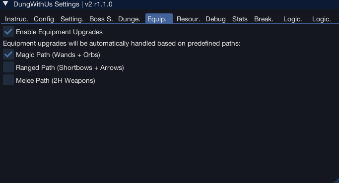

import React from 'react';
import TopBanner from '@site/src/components/TopBanner';
import ContentBlock from '@site/src/components/ContentBlock';
import Changelog from '@site/src/components/Changelog';
import BrowserWindow from '@site/src/components/BrowserWindow';
import changes from './changes.json'

<TopBanner title="DungWithUs" version="r1.0.0" author="BotWithUs" skill="Dungeoneering">
</TopBanner>

<ContentBlock title="Features">

> - Supports all combat styles + swaps, recommended setup is to run magic > range > melee, if using melee recommend you bring a range/mage swap, if using range recommended any melee swap
> - Script can be reloaded mid dungeon and it will continue solving
> - **Intelligent Equipment Upgrades**: Automatic equipment binding and upgrading with pre-defined combat loadouts
> - **Skilling Support**: Automatic resource gathering and crafting within dungeons
> - **Resource Management**: Intelligent resource prioritization and inventory management

</ContentBlock>

<ContentBlock title="Requirements">

> **Graphics Settings**
> - **Draw Distance**: Medium or High (required for proper detection and navigation)
> - **Interface Layout**: Prayer tab, equipment tab, and backpack must be visible
> - **Party Interface**: Must be extended so all buttons are visible when open
> 
> **Skill Requirements**
> The script will automatically check your skill levels and only gather resources you can access:
> - **Woodcutting**: Level 1+ (Tangle gum tree) to Level 90+ (Grave creeper tree)
> - **Fishing**: Level 1+ (Heim crabs) to Level 90+ (Cave morays)
> - **Mining**: Level 1+ (Novite ore) to Level 90+ (Promethium ore)
> - **Runecrafting**: Level 1+ (Air rune) to Level 77+ (Blood rune)
> - **Divination**: Level 1+ (Pale wisp) to Level 90+ (Radiant wisp)
> - **Crafting**: Level 1+ for basic leather items

</ContentBlock>

<ContentBlock title="Setup">

> **Initial Setup**
> - Start in demonheim
> - Prayer tab, equipment tab and backpack visible
> - Party interface window must be extended so all buttons are visible once open

<strong>GUI Configuration</strong>

> - **Target floor**: Current floor we will run
> - **Target complexity**: Current floor complexity
> - **Dungeon size**: Dungeon size
> - **Prestige enabled**: When enabled we will prestige once the current progress reaches the set floor

<strong>Settings Tab</strong>

> - **Pickup food**: Pickup and carry this much food during runs
> - **Buy feathers**: Buys feathers for fishing puzzle - must use if you don't have an unlock that doesn't require feathers for fishing
> - **Pickup and bury bones**: Will pickup and burry bones during exploration

<strong>Skilling Settings</strong>

> **Resource Gathering Options**
> - **Enable Woodcutting**: Automatically chop trees for branches
> - **Enable Fishing**: Fish for raw food (optional, enable buy feathers)
> - **Enable Mining**: Mine ores
> - **Enable Divination**: Harvest wisps for energy
> - **Enable Runecrafting**: Craft runes at altars
> - **Enable Crafting**: Craft leather items from hides
> - **Enable Portent Creation**: Create divination portents from energy
> 
> **Resource Selection**
> - **Auto Select Rune**: Automatically chooses the highest level rune you can craft
> - **Selected Rune**: Manually choose which rune to craft (if auto-select is disabled)
> - **Tree Selection**: Choose which types of trees to chop
> - **Fish Selection**: Choose which types of fish to catch
> - **Ore Selection**: Choose which types of ores to mine
> - **Wisp Selection**: Choose which types of wisps to harvest
> 
> **Advanced Options**
> - **Kill Mobs in Resource Room**: Automatically attack monsters in resource rooms
> - **Alternate Crafting/Runecrafting**: Switch between crafting and runecrafting on different floors
> - **Alternate Floor Count**: Number of floors to alternate between activities

<strong>Boss Settings</strong>

> - **Nightgazer pillars**: How many pillars we will light, the more damage you have the less pillars you can light.

<strong>Equipment Binding & Upgrade System</strong>

> **Pre-defined Combat Loadouts**
> 
> DungWithUs now features an intelligent equipment upgrade system with **pre-defined loadout paths**:
> 
> | Loadout | Combat Style | Equipment Focus |
> |---------|-------------|-----------------|
> | **1** | **Magic** | Wands + Orbs |
> | **2** | **Melee** | 2-Handed Weapons |
> | **3** | **Ranged** | Shortbows + Arrows |
> 
> **How It Works:**
> - **Automatic Path Selection**: Choose your preferred combat style and the script configures the appropriate loadout
> - **Smart Equipment Detection**: Scans bound items, backpack, and ground items for upgrades
> - **Tier-Based Upgrades**: Automatically identifies and equips higher tier equipment (Novite → Promethium)
> - **Intelligent Binding**: Only binds equipment you can use based on your combat levels
> - **Lower Tier Cleanup**: Automatically trashes lower tier equipment when better alternatives are available
> 
> **Configuration:**
> 1. Navigate to the **Equipment Binding** tab
> 2. Enable **"Enable Equipment Upgrades"**
> 3. Select your combat path:
>    - **Magic Path**: Wands + Orbs for magical combat
>    - **Melee Path**: 2-handed weapons for melee combat
>    - **Ranged Path**: Shortbows + Arrows for ranged combat
>    - This is also how loadout should be setup 1 2 and 3 respectively you can however add 2h sword to range loadout for bosses that need swaps
> 
> **Equipment Tiers (All Paths):**
> Novite (Lv1) → Bathus (Lv10) → Marmaros (Lv20) → Kratonium (Lv30) → Fractite (Lv40) → Zephyrium (Lv50) → Argonite (Lv60) → Katagon (Lv70) → Gorgonite (Lv80) → Promethium (Lv90)
> 
> **Notes:**
> - Only one combat path can be active at a time but you can manually add type of weapons to it
> - System automatically checks level requirements before binding
> - Members-only tiers (60+) are only available to members
> - Equipment upgrades happen automatically during dungeon exploration, we will initally cache the items and only check again once new higher tier item is bound and we have levels to use it

<strong>Skilling Resources</strong>

| Skill | Resource | Level Req | Members | Notes |
|-------|----------|-----------|---------|-------|
| **Woodcutting** | Tangle gum tree | 1 | No | Basic branches |
| | Seeping elm tree | 10 | No | |
| | Blood spindle tree | 20 | No | |
| | Utuku tree | 30 | No | |
| | Spinebeam tree | 40 | No | |
| | Bovistrangler tree | 50 | No | |
| | Thigat tree | 60 | Yes | |
| | Corpsethorn tree | 70 | Yes | |
| | Entgallow tree | 80 | Yes | |
| | Grave creeper tree | 90 | Yes | |
| **Fishing** | Heim crabs | 1 | No | Requires feathers |
| | Red-eye | 10 | No | |
| | Dusk eels | 20 | No | |
| | Giant flatfish | 30 | No | |
| | Short-finned eels | 40 | No | |
| | Web snippers | 50 | No | |
| | Bouldabass | 60 | Yes | |
| | Salve eels | 70 | Yes | |
| | Blue crabs | 80 | Yes | |
| | Cave morays | 90 | Yes | |
| **Mining** | Novite ore | 1 | No | Basic ore |
| | Bathus ore | 10 | No | |
| | Marmaros ore | 20 | No | |
| | Kratonium ore | 30 | No | |
| | Fractite ore | 40 | No | |
| | Zephyrium ore | 50 | No | |
| | Argonite ore | 60 | Yes | |
| | Katagon ore | 70 | Yes | |
| | Gorgonite ore | 80 | Yes | |
| | Promethium ore | 90 | Yes | |
| **Runecrafting** | Air rune | 1 | No | Requires rune essence |
| | Mind rune | 2 | No | |
| | Water rune | 5 | No | |
| | Earth rune | 9 | No | |
| | Fire rune | 14 | No | |
| | Body rune | 20 | No | |
| | Cosmic rune | 27 | No | |
| | Chaos rune | 35 | No | |
| | Astral rune | 40 | Yes | |
| | Nature rune | 44 | No | |
| | Law rune | 54 | No | |
| | Death rune | 65 | No | |
| | Blood rune | 77 | Yes | |
| **Divination** | Pale wisp | 1 | No | Harvest for energy |
| | Flickering wisp | 10 | No | |
| | Bright wisp | 20 | No | |
| | Glowing wisp | 30 | No | |
| | Sparkling wisp | 40 | No | |
| | Gleaming wisp | 50 | No | |
| | Vibrant wisp | 60 | Yes | |
| | Lustrous wisp | 70 | Yes | |
| | Brilliant wisp | 80 | Yes | |
| | Radiant wisp | 90 | Yes | |

<strong>Boss Information</strong>

| Boss Name | Prayer Type(s) | Special Mechanics |
| :---------------------------- | :--------------------- | :----------------------------------------------------------------------------------------------------------------------------------------------------------------------------------------------------------------------------------------------------------------------------------------------------------------------------------------------------------------------- |
| Astea Frostweb | Magic | None |
| Bal'lak the Pummeller | Melee | None |
| Blink | Magic | Periodically becomes unattackable and teleports. Player will move to the center of the room to keep closer to potential pillars. |
| Bulwark Beast | Ranged | Has a shield that must be broken (player will attempt to unequip ranged weapon if one is equipped, then mine the shield if a pickaxe is in the toolbelt). Re-equips ranged weapon after shield is broken. |
| Divine Skinweaver | Magic | Summons monsters and creates tunnels. Tunnels must be blocked. After all monsters are defeated and tunnels blocked, talks to the Divine Skinweaver to complete the fight. |
| Dreadnaut | Melee | None |
| Flesh-Spoiler Haasghenahk | Melee | Two-phase fight. Player will avoid being too close to the boss to avoid taking damage. After the first phase, the boss respawns for a second phase. |
| Gluttonous Behemoth | Magic | Player must stand between the boss and the carcass to block it. |
| Gravecreeper | Magic | Plinth special attack: Player must move away from plinths when they trigger special. |
| Har'Lakk the Riftsplitter | Melee | Player will move to a safe coordinate away from the special attack. |
| Hobgoblin Geomancer | Magic | None |
| Hope Devourer | Magic | None |
| Icy Bones | Magic | None |
| Kal'Ger the Warmonger | Melee | None |
| Lexicus Runewright | Magic | None |
| Luminescent Icefiend | Magic | Icicle attack. Player will move to room corners to avoid damage. |
| Necrolord | Magic | Player will attempt to swap to a non-melee weapon if a melee weapon is equipped and a non-melee weapon is in the backpack. If no suitable swap is found and only a melee weapon is present, the script will leave the dungeon. |
| Night-Gazer Khighorahk | Magic | Pillars of light will be lit. The number of pillars to light can be configured on GUI. |
| Plane-Freezer Lakhrahnaz | Magic | Ice attack. Player will move to avoid. |
| Rammernaut | Melee | Charge attack. Player will move out of the way of the charge. |
| Runebound Behemoth | Varies (Magic/Ranged/Melee) | Script determines player's weapon type to decide which crystal to deactivate. |
| Sagittare | Ranged | If a ranged weapon is equipped, the script will attempt to switch to a melee or magic weapon. If the player is stunned, the script will attempt to use the Freedom ability. |
| Shadow-Forger Ihlakhizan | Melee | None |
| Skeletal Trio | Magic (priority) | Attacks Skeletal Archer, then Skeletal Sorcerer, then Skeletal Warrior. |
| Stomp | Melee | Falling rocks mechanic will move to safe tile. Stone phase: player picks up colored crystals and uses them on corresponding active ones. Will mine debris blocking paths to crystals or stones. |
| To'Kash the Bloodchiller | Magic | If the player is stunned, the script will attempt to use the Freedom ability. |
| Unholy Cursebearer | Ranged | None |
| Warped Gulega | Melee | Special attack. Player will move to a safe coordinate. |
| World-Gorger Shukarhazh | Varies (Magic/Ranged/Melee) | Has three eyes (Warrior, Mage, Ranger). Player will attack the eyes to make the boss vulnerable to the current weapon style. |
| Yk'Lagor the Thunderous | Melee | Magical drag attack: Player attempts to move to a safe position. Earthquake attack: Player attempts to hide behind a pillar. |

</ContentBlock>

<ContentBlock title="Skilling Features">

> **Automatic Resource Management**
> The script intelligently manages resources throughout the dungeon:
> - **Resource Detection**: Automatically finds and prioritizes available resources based on your skill levels
> - **Inventory Management**: Sells gathered resources when inventory is full
> - **Resource Rotation**: Can alternate between different skilling activities across floors
> - **Unreachable Resource Handling**: Marks resources as unreachable if they cannot be accessed
> 
> **Resource Gathering Workflow**
> 1. **Exploration Phase**: Script explores rooms and identifies available resources
> 2. **Resource Selection**: Chooses the best available resource based on enabled skills and level requirements
> 3. **Gathering**: Interacts with resources and monitors gathering progress
> 4. **Inventory Management**: Sells excess resources or drops portents when needed
> 5. **Crafting**: Processes gathered materials into useful items (runes, leather items, portents)
> 
> **Crafting Features**
> - **Runecrafting**: Automatically crafts the highest level rune available or selected rune
> - **Leather Crafting**: Crafts protomastyx hide into vambraces or body armor
> - **Portent Creation**: Creates divination portents from harvested energy
> - **Material Purchasing**: Buys required materials (rune essence, thread, hides) from the smuggler
> 
> **Resource Prioritization**
> The script prioritizes resources based on:
> - **Skill Level Requirements**: Only gathers resources you can access
> - **Resource Availability**: Focuses on resources in completed puzzle rooms
> - **Inventory Space**: Manages inventory efficiently by selling excess items
> - **Resource Type**: Balances between different resource categories based on settings
> 
> **Smart Navigation**
> - **Resource Room Detection**: Automatically finds rooms with available resources
> - **Pathfinding**: Navigates efficiently between resource rooms and the start room
> - **Obstacle Avoidance**: Handles unreachable resources and blocked paths
> - **Combat Integration**: Attacks monsters in resource rooms if enabled

</ContentBlock>

:::hidden
## Changelog
:::

<Changelog changes={changes}></Changelog>