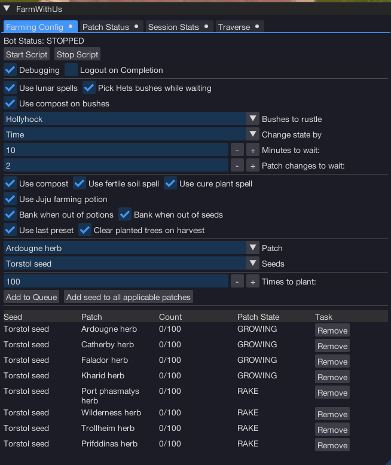

import React from 'react';
import TopBanner from '@site/src/components/TopBanner';
import ContentBlock from '@site/src/components/ContentBlock';
import Changelog from '@site/src/components/Changelog';
import BrowserWindow from '@site/src/components/BrowserWindow';
import changes from './changes.json'

<TopBanner title="FarmWithUs" version="v1.0" author="sadness" skill="Farming">
</TopBanner>

:::hidden

## Cost

:::

<ContentBlock title="Cost">

> - $20/Month

</ContentBlock>

:::hidden

## Features

:::

<ContentBlock title="Features">
FarmWithUs has support for the majority of tree, flower, herb and normal allotments throughout RuneScape. The bot will automatically perform farming runs and the associated tasks including planting seeds, harvesting crops, composting patches, and interacting with allotment specific NPCs for noting items, accessing compost and buying plant cure.
#
> - Uses a task queue for farming which will perform raking weeds, planting seeds, watering patches, curing diseased plants, and harvesting crops on selected patches as needed.
> - Uses nav system to traverse to the different farming allotments. Suggested to stock up on vis wax.
> - Lunar spells: fertile soil and cure plant supported. These must be somewhere on your Action Bar, and you must have the runes required (eg: elemental staff and a rune pouch equipped).
> - Juju farming potions supported.
> - Option to pick the bushes at hets oasis while waiting for allotment states to change.
> - Configurable parameters for patch change functionality when waiting at hets oasis. Change state a random amount of time after X number of patches change, or instantly traverse on X patch changes.
> - Will remove tasks from the queue if there are no seeds or seedlings available in your inventory after banking.
> - Herb patches support crux equal upgrades and will automatically plant the max number of seeds.
> - Magic watering can is supported.
> - Will buy compost, plant cure and watering cans if not in the inventory.
> - Great supplementary money maker from the golden roses at hets oasis. Between $4-10M/Hr

#
## Supported locations/patches
> - Ardougne: Allotments, Herb & Flower patches
> - Catherby: Allotments, Herb & Flower patches
> - Falador: Allotments, Herb & Flower patches
> - Port Phasmatys: Allotments, Herb & Flower patches
> - Tree patches: Lumbridge, falador, taverly, prifddinas & gnome stronghold
> - Misc herb patches: Garden of Kharid herb, wilderness, trollheim & prifddinas

#
## Things to note
> - The script will NOT create tree saplings for you. You must have saplings in your inventory/bank preset, or it will remove the task from the queue.
> - If using the trollhiem herb patch, ensure you have climbing boots equipped or in your inventory otherwise traversal will fail.
> - Use the wilderness herb patch at your own risk.
> - If you don't pick bushes at hets oasis, it will idle at your last location.
> - Make sure you meet the level requirements to pick your respective bush at hets oaisis.

#
## Known issues
> - Varrock tree patch is disabled due to a system nav issue, investigating.

#
### Shout outs
> - Cipher for providing the BushesWithUs code base
> - KBD for collecting several of the allotment varbits (manually!)
</ContentBlock>

:::hidden

## Requirements

:::
<ContentBlock title="Requirements">

> - Create a bank preset and have a minimum of 10 seeds, as well as juju potions if using them.
> - If planting trees, ensure you have the tree sapling in your inventory/bank preset.
> - Select your script options such as whether to use compost, lunar spells, picking hets bushes or banking when out of any items listed.
> - Click start.

</ContentBlock>

<ContentBlock title="Coming Soon/To-Do">

> - World hopping
> - Automatically select bush based on farming level at hets oaisis
> - Support to pickpocket crux eqal knights as an alternative to hets oasis bushes.
> - Automatically detect and remove tasks when farming location prereqs are not met (eg, priff & trollheim).
> - Refill sign of the porters if found in the inventory.
> - Support for fruit trees & bush patches.
> - Support for adding food to, and removing from the compost bin.
> - Make FarmWithUs a background script (mid to long term goal).

</ContentBlock>

<ContentBlock title="UI Overview">

> - When clicking **"Add seed to all applicable patches"**, it will automatically add the selected seed to the selected patch type. For example, selecting Torstol seed and any herb patch (Ardougne herb for example) will add it to *all* herb patches. You can then remove the ones you don't meet the requirements for. Or, do it manually. Fill ya boots.
# 
> - Use lunar skills: unlocks options for usage of lunar skills
> - Pick hets bushes while waiting: Highly recommended and on by default.
> - Use compost on bushes: Will only be displayed/available if you are using lunar skills fertile soil.
> - Change state by: Time or Patch Changes. If time, it will choose a random time within your selected time period before moving to the farming patch based on the number that need attention. If patch changes, the script will move immediately when hitting the threshold of queued patches needing attention. 
> - Use compost: Whether to use compost on your allotments.
> - Use fertile soil & use cure plant spell: uses spells instead of compost and plant cure respectively. Must be on action bar and must have runes.
> - Bank when out of potions: If you run out of juju potions, it will load a bank preset. If there are none left in your preset, it will untick this option.
> - Bank when out of seeds: same as above, will bank when no seeds are found in your inventory.

</ContentBlock>
:::hidden
## Changelog

:::

<Changelog changes={changes}>

</Changelog>
