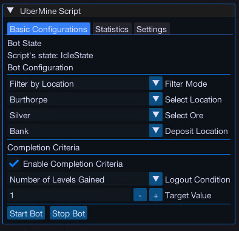
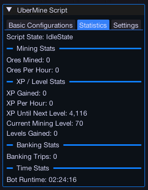

import React from 'react';
import TopBanner from '@site/src/components/TopBanner';
import ContentBlock from '@site/src/components/ContentBlock';
import Changelog from '@site/src/components/Changelog';
import BrowserWindow from '@site/src/components/BrowserWindow';
import changes from './changes.json';

<TopBanner title="UberMine" version="v1.0.0" author="Uberith" skill="Mining" />

---

## Cost

<ContentBlock title="Cost">

- **Subscription:** 3 Coins / Week (not including client access)

> Start mining smarter today for just 3 coins per week!

</ContentBlock>

---

## Features

<ContentBlock title="Features">

### Main Interface  

### Core Features

- **Automatic Navigation:**  
  Automatically navigates to precise, coordinate-based mining spots, ensuring efficient transitions between locations, banks, and forges.

- **Persistent Settings:**  
  Save preferences across sessions, including:  
    - Selected mining locations  
    - Preferred ore types  
    - Inventory management options  

- **Human-like Random Delays:**  
  Mimics human behavior with randomized delays in interactions and movement, reducing bot-detection risk.

- **Intelligent Banking Automation:**  
  Detects when your inventory is full, automatically banks ores, and resumes mining without manual intervention.

- **Statistics Page:**  
  Provides real-time feedback, including:  
    - Total ores mined  
    - Time elapsed  
    - Experience gained  

- **Rockerunities Support:**  
  Recognizes and prioritizes rockertunities for maximum efficiency and XP boosts during mining.

---

### Supported Mining Locations  

UberMine supports a wide range of mining locations optimized for both low and high-level players:

| Location                       | Supported Ores                                  |
|--------------------------------|------------------------------------------------|
| **Burthorpe**                  | Copper, Tin, Clay, Iron, Silver, Common gem rock | 
| **Dwarven Mine**               | Coal, Copper, Iron, Luminite, Tin               | 
| **Dwarven Mine - Miners' Guild** | Coal, Orichalcite, Runite                      | 
| **Varrock - Rune Essence**     | Rune Essence                                    | 
| **Varrock - West**             | Copper, Tin, Mithril, Adamantite               | 

---

### Advanced Features

- **Control Buttons:**  
  Start, pause, or stop the script seamlessly using integrated controls for greater flexibility.  

- **Real-Time Feedback:**  
  Monitor mining progress, resource availability, and efficiency with detailed statistics.  

</ContentBlock>

---

## Screenshots  

  
  

---

## Requirements

<ContentBlock title="Requirements">

- Equip a pickaxe appropriate for the selected ores.  
- For magic notepaper functionality, ensure it’s in your inventory.  

</ContentBlock>

---

## Product Roadmap

<ContentBlock title="Product Roadmap">

> ### Planned Features
> - **Player Suggestion:** Add secondary actions for high-level ores like Runite, such as teleporting to another location or switching to lower-level ores during respawn.  
> - **New Features:**  
>   - Perfect Juju Potion and mining boost integration.  
>   - Support for mining familiar pouches (e.g., Lava Titan) for bonus XP.  
>   - Incense Stick and mining aura support.  
> - **Anomaly Detection:**  
>   Implement real-time monitoring for behavior adjustments, such as:  
>     - Variations in movement speed.  
>     - Occasional pauses to simulate breaks.  
>     - Random interactions with nearby game objects (like examining rocks or items).  

</ContentBlock>

---

<Changelog changes={changes} />
