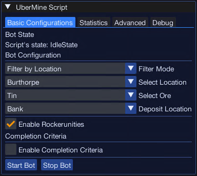
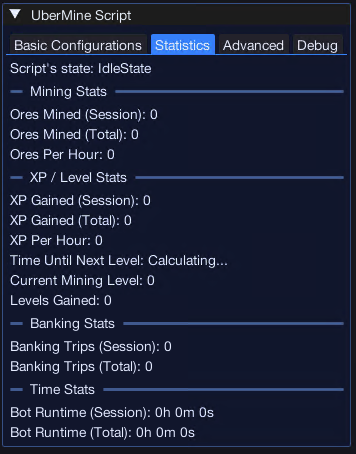
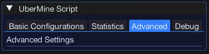

import React from 'react';
import TopBanner from '@site/src/components/TopBanner';
import ContentBlock from '@site/src/components/ContentBlock';
import Changelog from '@site/src/components/Changelog';
import BrowserWindow from '@site/src/components/BrowserWindow';
import changes from './changes.json';

<TopBanner title="UberMine" version="v1.0.0" author="Uberith" skill="Mining">
</TopBanner>

---

## Cost

<ContentBlock title="Cost">

 - **Cost**: 3 Coins / Week (not including client access)

</ContentBlock>

---

## Features

<ContentBlock title="Features">

> - **Automatic Ore Selection**: Dynamically adjusts to mine user-specified ores, with options to filter by location or ore type, ensuring optimal mining paths.  
> - **Location Mapping**: Supports mining at popular locations like Burthorpe, Dwarven Mine, Draynor Village, and more, with precise coordinates for ores, banks, and forges.  
> - **Persistent Settings**: Saves user preferences such as the selected location, ore type, and banking/forge options to maintain continuity across sessions.  
> - **Ore Box Integration**: Detects ore boxes in the player’s inventory, automating their usage to free up space and maximize efficiency during mining.  
> - **Forge and Bank Automation**: Determines whether to bank ores or use a forge, dynamically choosing the appropriate destination based on user preferences.  
> - **Customizable Completion Criteria**: Allows users to set goals such as mining a specific number of ores or completing a task at a specific location.  
> - **Member-Only Ores and Locations**: Supports premium ores and locations like Gold, Mithril, and Adamantite, as well as restricted areas like the Mining Guild.  
> - **Real-Time Inventory Monitoring**: Detects when the backpack is full and triggers the appropriate action, such as depositing at a bank or using a forge.
> - **User-Friendly Debugging**: Includes a debug panel to track script activity and performance, aiding in optimization and troubleshooting.  
> - **Multi-Location Adaptation**: Optimized paths and behaviors for over 10 mining locations, each tailored to its unique ores and resources.  

### Supported Locations

> - Barbarian Village  
> - Burthorpe  
> - Draynor Village  
> - Dwarven Mine  
> - Dwarven Mine - Miners Guild  
> - Garden of Kharid  
> - Lumbridge Swamp East  
> - Lumbridge Swamp West  
> - Manor Farm  
> - Mudskipper Point  
> - Port Sarim  
> - Varrock - Rune Essence  
> - Varrock - East  
> - Varrock - West  

### Supported Ores

> - Clay  
> - Copper  
> - Tin  
> - Coal  
> - Iron  
> - Silver  
> - Gold  
> - Mithril  
> - Adamantite  
> - Runite  
> - Blurite  
> - Luminite  
> - Orichalcite  

</ContentBlock>

---

## Requirements

<ContentBlock title="Requirements">

> - Must be equipped with a pickaxe suitable for the ores being mined.  
> - If using an ore box, it must be compatible with the selected ores.  
> - For members-only ores or locations, the player must have an active membership.  

</ContentBlock>

---

## Menu Screens

<ContentBlock title="Menu Screens">

### Main Configuration Screen

### Statistics Panel

### Advanced Settings Panel (Under Construction)

### Debug Panel

</ContentBlock>

---

## Product Roadmap

<ContentBlock title="Product Roadmap">
> - **Player Suggestion**: Implement support for Juju mining potions and other boosts to enhance mining efficiency.  
> - Add support for player-driven automation goals, such as mining a full inventory of ores and then smelting at a forge.  
> - Improve pathfinding and avoidance of high-traffic areas to optimize efficiency in competitive environments.  
> - Introduce anomaly detection for real-time adjustments to script behavior, including small variations in mining and movement patterns.  
> - Implement support for multiple mining tasks within a single session, such as switching between ore types or locations dynamically.  

</ContentBlock>

---

<Changelog changes={changes} />
