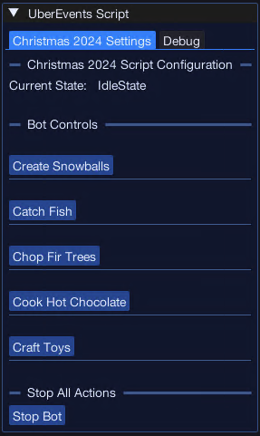
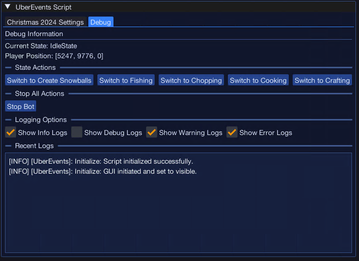

import React from 'react';
import TopBanner from '@site/src/components/TopBanner';
import ContentBlock from '@site/src/components/ContentBlock';
import Changelog from '@site/src/components/Changelog';
import BrowserWindow from '@site/src/components/BrowserWindow';
import changes from './changes.json';

<TopBanner title="UberEvents" version="v1.0.0" author="Uberith" skill="Necromancy">
</TopBanner>

---

## Cost

<ContentBlock title="Cost">

 - **Cost**: Free (not including client access)

</ContentBlock>

---

## Features

<ContentBlock title="Features">

> - **Automated Event Participation**: Streamlines participation in RuneScape's Christmas 2024 event, ensuring maximum rewards with minimal effort.  
> - **Task Automation**: Automatically completes event-specific tasks, including collecting items, crafting event-related objects, and turning in tasks.  
> - **Dynamic Navigation**: Guides the player to event locations efficiently, using precise coordinates to minimize downtime.  
> - **Gift Collection Optimization**: Detects and prioritizes the collection of event gifts or rewards, ensuring no items are missed.  
> - **Anti-Detection Mechanisms**: Implements randomized delays and human-like behavior patterns to reduce the risk of detection during prolonged event participation.  
> - **Real-Time Progress Tracking**: Displays statistics such as tasks completed, rewards earned, and event progress in real time.  
  

### Supported Event

> - **Christmas 2024**: Fully automates the RuneScape Christmas 2024 event, including all event-specific activities and rewards.  

</ContentBlock>

---

## Requirements

<ContentBlock title="Requirements">

> - Access to the Christmas 2024 event.  
> - Sufficient inventory space for collecting rewards and event items.  

</ContentBlock>

---

## Menu Screens

<ContentBlock title="Menu Screens">

### Main Configuration Screen

### Debug Panel

</ContentBlock>

---

## Product Roadmap

<ContentBlock title="Product Roadmap">
> - **Expand Event Support**: Add automation for upcoming RuneScape seasonal events such as Easter, Halloween, and Summer events.  
> - **Task Customization**: Allow users to prioritize specific event tasks or rewards based on personal goals.  
> - **Dynamic Event Detection**: Automatically detect and adapt to active events in the game, reducing setup time for users.  
> - **Reward Optimization**: Introduce algorithms to prioritize high-value rewards or rare items during events.  
> - **Advanced Debugging Tools**: Provide in-depth logs and insights to help users monitor and fine-tune the script's behavior.  

</ContentBlock>

---

<Changelog changes={changes} />
