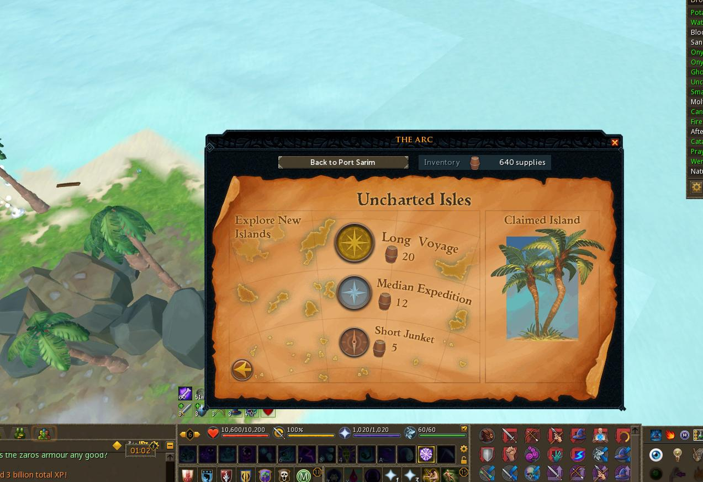
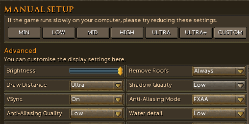
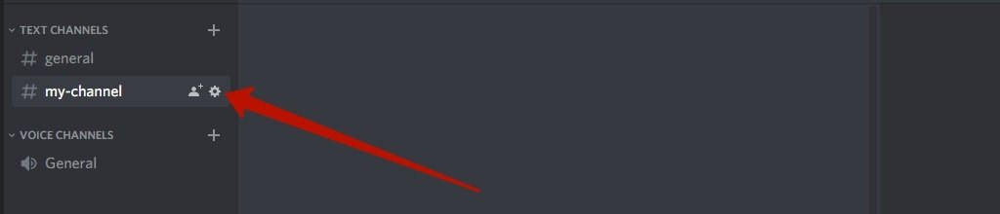
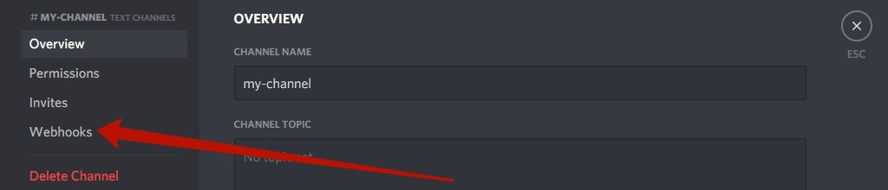
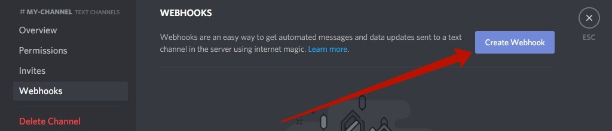
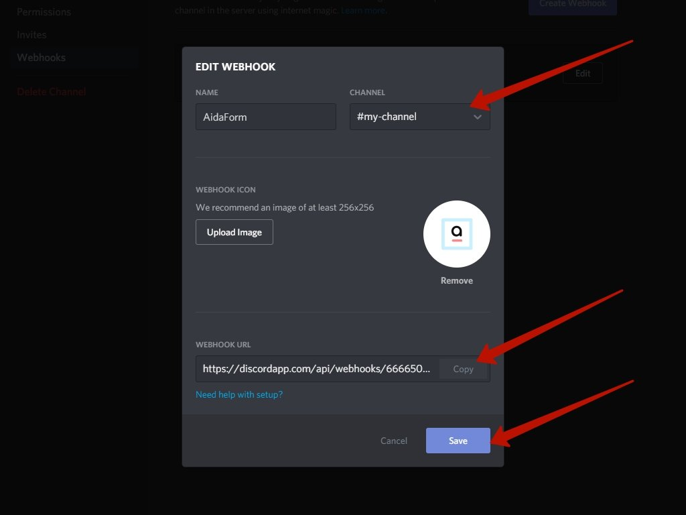

import React from 'react';
import TopBanner from '@site/src/components/TopBanner';
import ContentBlock from '@site/src/components/ContentBlock';
import Changelog from '@site/src/components/Changelog';
import BrowserWindow from '@site/src/components/BrowserWindow';
import changes from './changes.json'

<TopBanner title="vArc" version="v0.0.1" author="Vopori" skill="Woodcutting">
</TopBanner>

:::hidden

## Cost

:::

<ContentBlock title="Cost">

> - BETA - Currently Invite Only
> - 15 Coins / Month After Beta

</ContentBlock>

:::hidden

## Features

:::

<ContentBlock title="Features">

> - BETA Script - Please DM & report all issues.
> - Skills & gathers the following resources in uncharted isles:
>  - Golden Bamboo
>  - Mushrooms
>  - Wobbegongs
>  - Ancestral Energy
>  - (Script does not currently support tortles - use excess energy to transmute for now)
> - Automatically scans for and attempts to gather treasure chests & washed up supplies.
> - Walks closer to out of range resources to ensure interaction success.
> - Scans island periodically for resources and adds them to its internal list. Will interact with the closest resources.
> - Handles full inventory with depositing all items. GOTE is recommended. 
> - If no resources are found, will move around island scanning for out of range resources for a set number of times. If no resources are found, player will hop to another Long Voyage.
> - ONLY Long Voyages are currently supported.
> - Ensure player starts script in large island with the uncharted island selection screen already set on your rowboat.
> - Script will also not currently handle switching outfits/items per resource. Ensure your loadout has a decent skilling spread.
> - Will automatically send a message to your discord server when a new island is started with your resource counts.
> - XP Tracking for all Arc Skills.
> - Support for Green Maps & Ability to Logout when out of maps.
> - Banking Presets - Will use your selected preset when inventory is full.

</ContentBlock>

:::hidden

## Requirements

:::
<ContentBlock title="Requirements">

- Enough supplies to last the duration of your planned runtime. (Roughly 20 resources per hour)
- Decent skilling spread as script does not currently support switching loadouts.
- Render distance set to maximum and graphics set to lowest.
- Acess to Uncharted Isles (Obviously)

</ContentBlock>

:::hidden

## Setup

:::
<ContentBlock title="Setup">

Start in large island with uncharted island selection screen already set on your rowboat.

> - The settings above should show when you use the "Leave" option on the rowboat.

UI Settings Guide

> - Ensure your UI settings are set to the minimum with maximum render distance.

Discord Webhook Setup

> - First, you need to create a Discord channel to receive vArc notifications.

> - Log in to Discord, open your server, open the Discord channel you want to receive AidaForm notifications. From the channel menu, select Edit channel (click the small cog button).

> - On the left side panel click on Webhooks menu item.

> - Click the Create Webhook button, fill in the Webhook Name, select a channel from the drop-down menu you’d like to send responses, and optionally, edit the avatar of your choice.

> - Scroll down a bit, and you’ll find the Webhook URL that needed to be provided to vARc settings window. Simply, paste it into the Webhook URL field.

</ContentBlock>

:::hidden

## Changelog

:::

<Changelog changes={changes}>

</Changelog>
