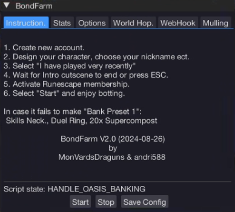
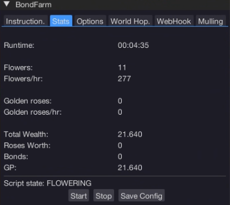
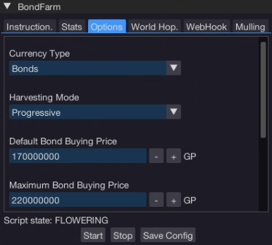
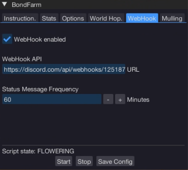
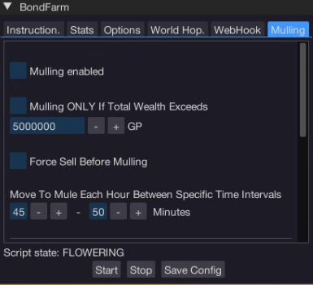
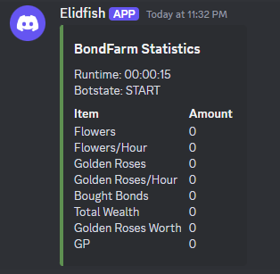

import React from 'react';
import TopBanner from '@site/src/components/TopBanner';
import ContentBlock from '@site/src/components/ContentBlock';
import Changelog from '@site/src/components/Changelog';
import BrowserWindow from '@site/src/components/BrowserWindow';
import changes from './changes.json'

<TopBanner title="Bond Farm" version="v2.0" author="MonVardsDraguns & andri588" skill="Farming">
</TopBanner>

:::hidden

## Cost

:::

<ContentBlock title="Cost">

> - 30 days sub for 10 Coins.

</ContentBlock>

:::hidden

## Requirements

:::

<ContentBlock title="Requirements">

> - A New Account  
> - Membership

</ContentBlock>

:::hidden

## Introduction to BondFarm
:::

<ContentBlock title="Introduction to BondFarm">

> The BondFarm script is a sophisticated RuneScape bot meticulously designed to automate the process of farming and trading items, enabling players to accumulate in-game currency for purchasing Bonds. This script employs a multi-faceted approach to maximize efficiency and profitability, ensuring a steady acquisition of Bonds. Updated to BondFarm v2, the script now includes improved G.E. logic, automatic P2P world detection, refined bank preset handling, and new harvesting modes, among other enhancements.

</ContentBlock>

:::hidden

## Features

:::

<ContentBlock title="Features">

> - **Gathers Starting Money**: Added support for targeting and harvesting pale wisps.  
> - **Grand Exchange Handling**: Automated interactions for buying/selling acquired and required items.  
> - **Farming Activities**: Added functionality to navigate and level up farming in POF, use supercompost, and collect golden roses within Het's Oasis.  
> - **Banking**: Implemented setting up a preset for efficient inventory management at Het's Oasis.  
> - **World Hopping**: Reworked world-hopping feature to avoid other players and enhance efficiency.  
> - **Bond Management**: Disabled "Bonds_Activate" function, as redeeming Bond codes was removed from the game.  
> - **Customizable Parameters**: Enabled user configuration for world hopping and bond price limits.  
> - **Mulling (Beta)**: Introduced a feature for wealth trading to another account, including options for selling/not selling flowers before mulling and setting specific times for mulling each hour.  
> - **Statistics**: Added tracking for key metrics like total wealth, golden roses worth, and GP for performance insights.

</ContentBlock>

:::hidden

## Detailed Functionality

:::

<ContentBlock title="Detailed Functionality">

> - **Divination**: The bot initiates by engaging in divination activities, specifically targeting pale wisps. It moves the player to the Energy Rift, configures it, and starts harvesting pale wisps. It monitors the inventory and converts memories when the backpack is full, ensuring continuous collection of resources.  
> - **Grand Exchange Interactions**: Once sufficient pale energy is collected, the bot navigates to the Grand Exchange (GE). It handles interactions with the GE clerks to sell the collected pale energy and other items, like roses, to accumulate gold pieces (GP). The bot also manages the tutorial for new players at the GE.  
> - **Item Purchasing**: With accumulated GP, the bot intelligently purchases necessary items such as Rings of Duelling, Skills Necklaces, and Supercompost from the GE, ensuring that the player is always equipped for subsequent tasks.  
> - **Farming**: The script transitions to farming activities once the necessary items are procured. It navigates to designated farming areas, turns manure for leveling up farming skills, and uses supercompost to enhance the growth of plants. It handles the collection and selling of roses, including the more valuable golden roses.  
> - **Banking**: The bot efficiently manages banking tasks at Het's Oasis, loading presets and withdrawing essential items to prepare for farming activities. It ensures that the player's inventory is optimally managed for continuous operations.  
> - **World Hopping**: The script includes a reworked world-hopping feature that allows the player to switch worlds to avoid crowded areas and ensure access to resources.  
> - **Wealth Accumulation and Mulling**: The bot can now mull wealth to another account if total wealth exceeds a certain limit. It also allows for wealth trading at specific times and locations.  
> - **Event Handling**: The script is equipped to handle various game events, such as inventory updates and chat messages. It responds to these events by adjusting the bot’s state and actions, ensuring smooth and adaptive operation.

</ContentBlock>

:::hidden

## Configuration and Persistence

:::

<ContentBlock title="Configuration and Persistence">

> The script supports configurable parameters, allowing users to customize aspects like world-hopping distance, time, and bond price limits. It saves these configurations and loads them upon initialization, providing a seamless and personalized botting experience.

</ContentBlock>

:::hidden

## Statistics and Monitoring

:::

<ContentBlock title="Statistics and Monitoring">

> Throughout its operation, the bot keeps track of key metrics such as total wealth, golden roses worth, and GP, updating statistics to provide insights into its performance. This helps users understand the efficiency and effectiveness of the bot in real-time.

</ContentBlock>

:::hidden

## Summary

:::

<ContentBlock title="Summary">

> Overall, the BondFarm script offers a comprehensive and automated solution for RuneScape players looking to efficiently farm resources and trade them for Bonds. Its intelligent design, robust state management, and adaptive functionalities make it a powerful tool for optimizing in-game currency acquisition and enhancing gameplay.

</ContentBlock>

:::hidden

## My Recommendation

:::

<ContentBlock title="My Recommendation">

> - Use the auto login module from BWU in case you get kicked offline while changing worlds.  
> - Bot on fresh accounts rather than old ones.  
> - Use a username that doesn't look auto-generated.  
> - If collecting bond codes, and you get banned, check the mail, and the codes should still be there.

</ContentBlock>

:::hidden

## GUI

:::

<ContentBlock title="GUI">

  
  
  
  

</ContentBlock>

:::hidden

## Changelog

:::

<Changelog changes={changes}>

</Changelog>
