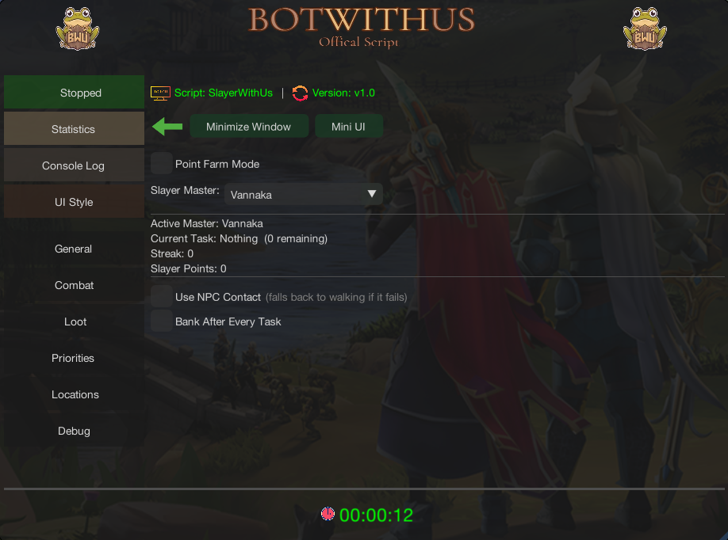
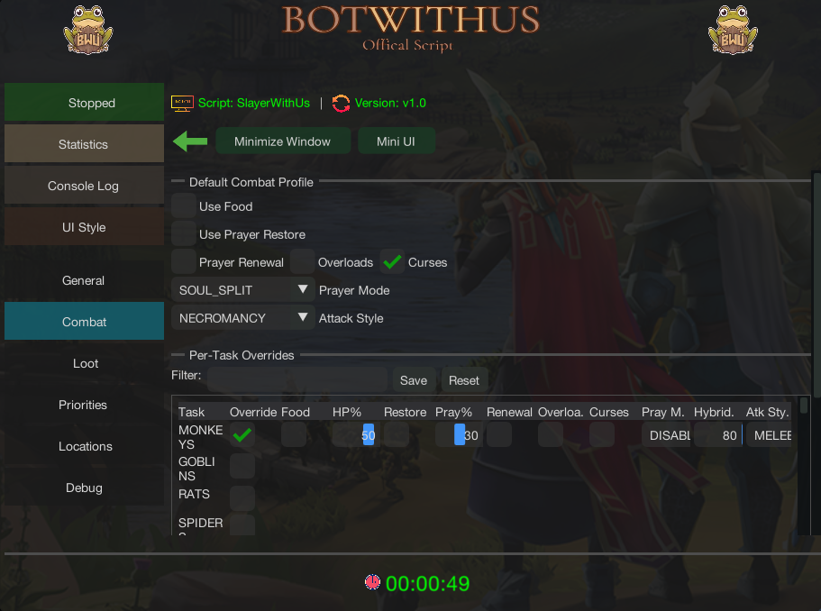
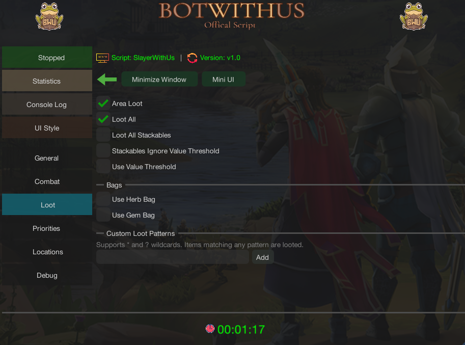

import React from 'react';
import TopBanner from '@site/src/components/TopBanner';
import ContentBlock from '@site/src/components/ContentBlock';
import Changelog from '@site/src/components/Changelog';
import changes from './changes.json'

<TopBanner title="SlayerWithUs" version="v1.0.0" skill="Slayer">
</TopBanner>

:::::hidden

## Overview

:::::

<ContentBlock title="Overview">

> SlayerWithUs is a comprehensive all-in-one Slayer script supporting virtually **all Slayer tasks** across **every Slayer master**. It handles task assignment, navigation, combat, looting, banking, death recovery, and custom pathing — all fully configurable per task. The script uses Revolution++ for abilities and manages a full state-machine lifecycle that covers everything from getting a task to banking loot after completion.

</ContentBlock>

<ContentBlock title="Features">

> - Automatic task assignment via NPC Contact or walking to master
> - Point farming mode with dedicated 10th-task bonus master
> - Per-task combat profiles with prayer, potion, and food management
> - Multiple attack styles: Melee, Ranged, Magic, Necromancy
> - Multiple prayer modes: Disabled, Soul Split, Protect by Style, Hybrid
> - Automatic protection prayer switching based on monster attack style (supports both normal prayers and curses)
> - Area looting with value threshold and wildcard patterns
> - Herb bag and gem bag auto-stashing (supports upgraded herb bag)
> - Built-in combat overrides for monsters with special kill mechanics
> - Built-in navigation overrides for hard-to-reach locations
> - Custom path system with multiple step types for user-defined navigation
> - Multiple bank teleport methods with per-task teleport assignment
> - Configurable banking triggers (no food, no prayer pots, no overloads, backpack full)
> - Automatic death recovery with item reclamation
> - Per-task location selection with configurable combat radius
> - Per-task navigation options (teleports, Surge, Dive toggles)
> - Task priority system for preferred task ordering
> - Configuration sharing via import/export share codes
> - Scripture activation support during combat
> - Dramen staff support for Zanaris access

</ContentBlock>

<ContentBlock title="Supported Masters">

> | Master | Location |
> |--------|----------|
> | **Turael** / **Spria** | Burthorpe |
> | **Jacquelyn** | Lumbridge |
> | **Vannaka** | Edgeville |
> | **The Raptor** | Varrock |
> | **Mazchna** / **Achtryn** | Canifis |
> | **Chaeldar** | Zanaris |
> | **Sumona** | Pollnivneach |
> | **Lapalok** / **Duradel** | Shilo Village |
> | **Kuradal** | War's Retreat |
> | **Morvran** | War's Retreat |
> | **Laniakea** | Anachronia |
> | **Mandrith** | Edgeville (Wilderness) |

</ContentBlock>

<ContentBlock title="Requirements">

> - **Area Looting** enabled in-game (Settings > Gameplay > Loot > "Loot System" set to Area Loot, with "1 item opens loot window" enabled)
> - An appropriate **combat gear setup** and **Revolution++ action bar** configured for your chosen attack style
> - **NPC Contact** on your action bar if using automatic task assignment without walking to the master
> - **Food, prayer potions, and overloads** (if enabled) in your bank — the script withdraws these automatically via bank presets
> - Slayer level appropriate for your chosen master
> - **Dramen staff** in inventory if doing Chaeldar tasks
> - Appropriate **Slayer helmet variant** equipped (the script checks for all variants including corrupted, mighty, etc.)

</ContentBlock>

:::::hidden

## Quick Start

:::::

<ContentBlock title="Quick Start Guide">

> 1. **Select your Slayer master** in the General tab (or enable Point Farm Mode and pick both a quick master and a bonus master)
> 2. **Configure your default combat profile** in the Combat tab — set your attack style, prayer mode, and food/potion thresholds
> 3. **Set loot rules** in the Loot tab — minimum GP value, stackables behavior, herb/gem bag usage, and any custom item patterns
> 4. **Review task locations** — the script picks default locations for each task, but you can override them and adjust the combat radius
> 5. **Click Start** — the script will detect any in-progress task and resume it, or go get a new assignment
>
> **Optional**: Set per-task combat overrides, task priorities, bank teleport preferences, and custom navigation paths for tasks where the default pathing doesn't reach your preferred spot.

</ContentBlock>

:::::hidden

## General Settings

:::::

<ContentBlock title="General Settings">

> **Master Selection**
> - **Slayer Master**: Select your primary Slayer master from the supported masters list
> - **Current Task Handling**: If you already have a task in progress, the script detects it automatically and resumes from where you left off
>
> **Point Farm Mode**
> - **Enable Point Farm Mode**: Toggles point farming — the script uses a low-level master (e.g. Turael/Spria) for fast tasks 1-9, then switches to a high-level **Bonus Master** every 10th task for the bonus Slayer point reward
> - **Bonus Master**: The high-level master to use on every 10th task (defaults to Morvran)
>
> **Task Assignment**
> - **Use NPC Contact**: Uses the NPC Contact spell on your action bar to get tasks remotely instead of walking to the master — automatically falls back to walking if the spell is unavailable or fails
>
> **Banking**
> - **Bank After Every Task**: Deposits all loot at a bank between each task completion
> - **Banking Triggers**: Fine-tune when the script returns to bank mid-task:
>   - *Bank on No Food* — Returns to bank when you run out of food
>   - *Bank on No Prayer Restore* — Returns to bank when prayer restore potions are depleted
>   - *Bank on No Overloads* — Returns to bank when overload potions run out
>   - *Bank on Backpack Full* — Returns to bank when your backpack fills up (herb/gem bags are filled first if enabled)
>
> **Other Options**
> - **Scripture**: Activates your equipped scripture/book during combat for passive bonuses
> - **Dramen Staff**: Equips a Dramen staff when navigating through Zanaris (required for Chaeldar unless you've completed Lumbridge/Draynor Elite diary)

</ContentBlock>

:::::hidden

## Combat Settings

:::::

<ContentBlock title="Combat Settings">

> The **Default Combat Profile** applies to all tasks unless you set a per-task override:
>
> **Attack Style**
> - Choose from **Melee**, **Ranged**, **Magic**, or **Necromancy**
>
> **Prayer Mode**
> - **Disabled** — No prayer management
> - **Soul Split** — Keeps Soul Split active at all times during combat
> - **Protect by Style** — Automatically activates the correct protection prayer based on the monster's primary attack style (e.g. Protect from Melee for melee monsters). The script has a built-in registry of monster attack styles
> - **Hybrid** — Uses Soul Split while your HP is above the configured threshold, and switches to the appropriate protection prayer when HP drops below it (default threshold: 80%)
>
> **Curses Toggle**
> - When enabled, uses **Deflect** curses (Deflect Melee, Deflect Missiles, Deflect Magic, Deflect Necromancy) instead of Protect prayers
>
> **Sustain**
> - **Food**: Automatically eats when HP drops below the configured **heal threshold** (default: 50%). The script searches your backpack for any edible items
> - **Prayer Restore**: Drinks prayer potions when prayer points drop below the configured **prayer threshold** (default: 30%). Supports: Prayer potions/flasks, Super restores/flasks, Super prayer potions/flasks, Replenishment potions/flasks, Enhanced replenishment potions/flasks, Spiritual prayer potions, Extreme prayer potions/flasks, and Sanfew serums
> - **Prayer Renewal**: Maintains prayer renewal buff (including Super prayer renewal)
> - **Overloads**: Maintains overload buff — re-drinks when the buff expires
>
> **Per-Task Overrides**
> - Enable the **Override** toggle on any task in the combat table to create a custom combat profile for that specific task. This lets you use different attack styles, prayer modes, and thresholds for different tasks (e.g. Necromancy with Soul Split for abyssal demons, but Melee with Protect from Magic for metal dragons)

</ContentBlock>

:::::hidden

## Task-Specific Combat Handling

:::::

<ContentBlock title="Task-Specific Combat Handling">

> The script includes **built-in combat overrides** that automatically handle monsters with special kill mechanics. These activate automatically when you're assigned the relevant task — no configuration needed:
>
> | Monster | Special Handling |
> |---------|-----------------|
> | **Rockslugs** | Uses a bag of salt to finish them off when low HP |
> | **Gargoyles** | Uses a rock hammer to smash them when low HP |
> | **Desert Lizards** | Uses ice coolers to finish them when low HP |
> | **Strykewyrms** (Jungle, Desert, Ice, Lava) | Stomps the mound to force them out of the ground before attacking |
> | **Wall Beasts** | Handles the unique wall-based interaction to engage them |
> | **Mogres** | Uses fishing explosives to summon them at Mudskipper Point |
> | **Mutated Zygomites** | Uses fungicide spray to finish them when low HP |
> | **Werewolves** | Handles the Wolfbane dagger mechanic to prevent transformation |
> | **Camel Warriors** | Handles the mirages mechanic during the fight |
> | **Living Wyverns** | Manages positioning to avoid their ice breath |
> | **Ripper Demons** | Evades the death spin special attack (moves away when triggered) |
>
> If a task is not yet supported by any override, the script will notify you via the **Unsupported Task** override and pause so you can handle it manually or skip the task.

</ContentBlock>

:::::hidden

## Loot Settings

:::::

<ContentBlock title="Loot Settings">

> **Value Filtering**
> - **Minimum Value**: Set a GP value threshold — items below this value are ignored (default: 5,000 GP)
> - **Loot All**: Picks up everything regardless of value (overrides the threshold)
> - **Loot All Stackables**: Picks up all stackable items (coins, runes, ammunition, etc.)
> - **Stackables Ignore Value Threshold**: When enabled, stackable items bypass the minimum value filter entirely — even if "Loot All Stackables" is off, any stackable above 0 GP is looted
>
> **Bag Support**
> - **Herb Bag**: Automatically stashes looted herbs into your herb bag during combat, freeing backpack space
> - **Upgraded Herb Bag**: Enable this if you have the upgraded herb bag for expanded herb storage
> - **Gem Bag**: Automatically stashes cut and uncut gems into your gem bag during combat
>
> When your backpack fills up and bags can no longer free space, the script automatically triggers a loot banking run before continuing combat.
>
> **Custom Loot Patterns**
> - Define wildcard patterns to always loot specific items regardless of value
> - Supports `*` (match any characters) and `?` (match single character) wildcards
> - Matching is **case-insensitive**
> - Examples:
>   - `*bone*` — loots all bones (Big bones, Dragon bones, etc.)
>   - `*charm` — loots all charms (Gold charm, Crimson charm, etc.)
>   - `Clue scroll*` — loots all clue scrolls
>   - `Spirit gem*` — loots all spirit gems

</ContentBlock>

:::::hidden

## Banking & Teleports

:::::

<ContentBlock title="Banking & Teleports">

> **Bank Teleports**
>
> The script supports several teleport methods to reach a bank quickly, even from mid-combat. You can set a **default bank teleport** and optionally assign **per-task teleports**:
>
> | Teleport | How It Works | Requirements |
> |----------|-------------|--------------|
> | **War's Retreat** | Uses War's Retreat Teleport from action bar | War's Retreat Teleport on action bar |
> | **Max Guild** | Uses Max Guild Teleport from action bar | 99 in all skills, teleport on action bar |
> | **Edgeville (Glory)** | Rubs equipped Amulet of Glory | Amulet of Glory equipped in neck slot |
> | **Daemonheim (Kinship)** | Uses Ring of Kinship from backpack | Ring of Kinship in backpack |
> | **Archaeology Guild** | Uses Archaeology Journal from backpack | Archaeology Journal in backpack |
>
> **Per-Task Teleports**: In the task configuration, you can assign a specific bank teleport for each task. This is useful if certain tasks are closer to a particular bank (e.g. using Edgeville Glory for Wilderness tasks instead of War's Retreat).
>
> **How Banking Works**
>
> When a banking trigger fires or a task completes, the script:
> 1. Teleports to your configured bank (or walks if the teleport fails)
> 2. Opens the bank booth or chest at the destination
> 3. Deposits loot and loads your bank preset for the next task
> 4. Navigates back to the task location and resumes combat

</ContentBlock>

:::::hidden

## Navigation

:::::

<ContentBlock title="Navigation & Locations">

> **Task Locations**
>
> Each task has one or more pre-configured locations. The script picks a default, but you can select a different one from the dropdown in the task configuration. Each location defines:
> - The exact coordinates where monsters are found
> - Which monster names to target at that location
> - A configurable **combat radius** — how far from the center the script will search for targets
>
> **Per-Task Navigation Options**
> - **Use Teleports**: Whether the script can use teleports when navigating to this task (enabled by default)
> - **Use Surge**: Whether the script uses the Surge ability to move faster (enabled by default)
> - **Use Dive**: Whether the script uses the Bladed Dive ability to move faster (enabled by default)
>
> These can be disabled for specific tasks where teleporting or surging might cause issues.
>
> **Built-In Navigation Overrides**
>
> The script includes special navigation handlers for locations that require more than simple walking:
>
> | Override | What It Handles |
> |----------|----------------|
> | **God Wars Dungeon** | Enters the GWD entrance and navigates to the correct encampment |
> | **Cave Horrors** | Navigates into the Mos Le'Harmless cave system |
> | **Crypt Undead** | Enters and navigates the Barrows crypt area |
> | **Kalphite Hive** | Enters the Kalphite cave and navigates to workers/soldiers/guardians |
> | **Sophanem Dungeon** | Enters the Sophanem Slayer Dungeon for Corrupted creatures and Soul devourers |
> | **World Gate** | Uses the World Gate for tasks on other planes (e.g. Muspah, Nihil on Freneskae) |
> | **Chaeldar (Zanaris)** | Enters the Zanaris fairy ring hub to reach Chaeldar |
>
> **Navigation Timeout**: The script has a walk timeout — if it hasn't reached the destination within the time limit, it re-evaluates the path. The state machine also has a safety timeout per state to prevent infinite loops.

</ContentBlock>

:::::hidden

## Custom Paths

:::::

<ContentBlock title="Custom Paths">

> Create custom navigation paths for any task/location combination. Useful for tasks where the built-in navigation doesn't reach your preferred spot, or when you need to go through doors, climb ladders, or interact with objects along the way.
>
> Custom paths **take priority** over all built-in navigation overrides.
>
> **Step Types:**
>
> | Step | Description |
> |------|------------|
> | **MOVE_TO** | Walk to absolute coordinates (X, Y, Plane) |
> | **MOVE_RELATIVE** | Move relative to current position |
> | **INTERACT_OBJECT** | Interact with a scene object (e.g. open a door, climb stairs, enter a cave) |
> | **INTERACT_NPC** | Interact with an NPC (e.g. talk to an NPC for access) |
> | **USE_ITEM** | Use an item from your backpack, equipment, or action bar |
> | **MINIMENU** | Right-click menu interaction on a specific target |
> | **INTERACT_INTERFACE** | Click a specific game interface component |
> | **WAIT** | Pause for a set duration in milliseconds |
> | **WAIT_FOR_INTERFACE** | Wait until a specific game interface opens (with timeout) |
> | **ATTACK** | Signals navigation is complete — the script begins combat at this point |
>
> Paths are saved per task and optionally per location key. Set an **Arrival Area** (center coordinates + radius) to define when the path is considered complete.
>
> **Sharing Custom Paths**
>
> You can export a custom path as a **share code** (format: `SWP1:...`) and share it with other users. To import a path, paste the share code in the import field.

</ContentBlock>

:::::hidden

## Task Priorities

:::::

<ContentBlock title="Task Priorities">

> When **Priority List** is enabled, you can assign a numeric priority to each task. The script uses these priorities to influence task selection:
> - **Higher priority** tasks are preferred when the master offers a choice
> - Tasks with **no priority set** are treated as neutral
> - Combine with Point Farm Mode to optimize both points and preferred tasks
>
> This is useful for focusing on tasks you want to complete (e.g. high XP tasks, profitable tasks, or tasks for a specific Slayer log).

</ContentBlock>

:::::hidden

## Configuration Sharing

:::::

<ContentBlock title="Configuration Sharing">

> **Export/Import Settings**
>
> You can share your entire SlayerWithUs configuration with other users using share codes:
> - **Export**: Generates a share code (format: `SWU1:...`) containing all your settings — master selection, combat profiles, loot rules, task priorities, and location selections
> - **Import**: Paste a share code to load another user's configuration
>
> This is a quick way to get started with a proven setup or to share your optimized configuration with friends.
>
> **Settings Persistence**
>
> All settings are automatically saved to `~/.bwu/slayerwithus/slayer_settings.properties` and persist between sessions. You don't need to reconfigure the script each time you start it.

</ContentBlock>

:::::hidden

## How It Works

:::::

<ContentBlock title="How the Script Works">

> SlayerWithUs runs a **state machine** that cycles through these phases:
>
> 1. **Idle** — Waiting to start or detecting current task
> 2. **Get Task** — Navigates to your Slayer master (or uses NPC Contact) and receives a new assignment
> 3. **Prepare** — Checks task requirements (special items like salt, rock hammer, etc.), banks to withdraw them, and buys from the Slayer master's shop if needed. Retries multiple times before marking the task as blocked
> 4. **Navigate to Task** — Travels to the selected task location using teleports, walking, and any applicable navigation overrides
> 5. **Combat** — Fights the assigned monsters: targets NPCs within the combat radius, manages sustain (food/prayer/overloads), activates prayers, delegates to task-specific combat overrides, and handles looting
> 6. **Bank** — When triggered (task complete, backpack full, supplies depleted), teleports to bank, deposits loot, and loads preset
> 7. **Death Recovery** — If you die, the script detects it, navigates to Death's Office, reclaims your items, and resumes the task
>
> The script tracks your **current task**, **kills remaining**, **Slayer points**, and **task streak** in real time by reading game variables.

</ContentBlock>

:::::hidden

## Troubleshooting

:::::

<ContentBlock title="Troubleshooting">

> **Script isn't looting items**
> - Make sure **Area Looting** is enabled in your RS3 settings (Settings > Gameplay > Loot)
> - Enable **"1 item opens loot window"** in the same settings panel
> - Check that your **Minimum Value** threshold isn't set too high
> - For specific items, add a **Custom Loot Pattern** (e.g. `*bone*`)
>
> **Script can't reach the task location**
> - Some locations require quest access — make sure you've completed the relevant quests
> - If the built-in navigation doesn't work for your location, create a **Custom Path**
> - Check that teleports/surge/dive are enabled for this task in the navigation options
>
> **"Prep Blocked" status**
> - This means the script couldn't find a required item after multiple attempts (checking backpack, bank, and shop)
> - Check that you have the required items in your bank (e.g. salt for Rockslugs, rock hammer for Gargoyles)
> - Some items can be bought from the Slayer master's shop — make sure you have enough coins or Slayer points
>
> **Prayer not activating**
> - Make sure the prayer/curse is on your **action bar** — the script activates prayers through the action bar
> - Verify you have the required Prayer/Curses level
> - Check that the correct **prayer mode** is set in your combat profile (or per-task override)
>
> **Script keeps going to bank**
> - Review your **banking triggers** — if "Bank on No Food" is enabled and you're not bringing food, it will trigger immediately
> - Make sure your bank preset includes enough supplies for the task

</ContentBlock>

:::::hidden

## Changelog

:::::

<Changelog changes={changes} />
