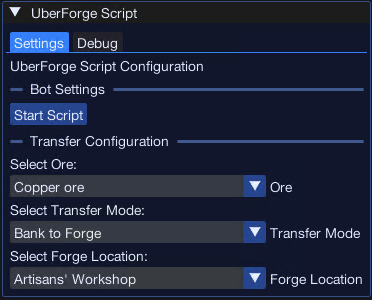
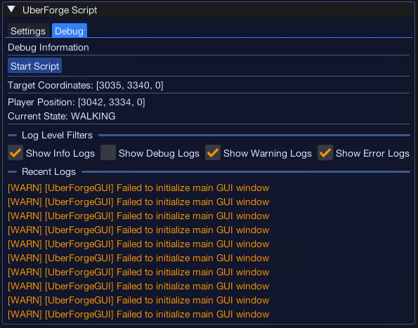

import React from 'react';
import TopBanner from '@site/src/components/TopBanner';
import ContentBlock from '@site/src/components/ContentBlock';
import Changelog from '@site/src/components/Changelog';
import BrowserWindow from '@site/src/components/BrowserWindow';
import changes from './changes.json';

<TopBanner title="UberForge" version="v1.0.0" author="Uberith" skill="Smithing" />

---

## Cost

<ContentBlock title="Cost">

- **Subscription:** 1 Coin / Month (not including client access)

> Automate ore transportation to the forge for just 1 coin per month — efficient and affordable!

</ContentBlock>

---

## Features

<ContentBlock title="Features">

### Main Interface  

### Core Features

- **Automatic Navigation:**  
  Effortlessly transfers ores from the bank to the forge in the **Artisan's Workshop**, ensuring a smooth and efficient smithing process.  

- **Persistent Settings:**  
  Save preferences across sessions, including:  
    - Preferred bank-to-forge configurations  
    - Ore management options  

- **Support for All Ores:**  
  Automatically handles all ores, from Copper to Runite, making it suitable for players at any level.  

- **Human-like Random Delays:**  
  Introduces randomized delays and pathing to simulate human behavior, reducing detection risks.  

- **Seamless Workflow:**  
  Ensures continuous transportation of ores, minimizing downtime and maximizing smithing efficiency.  

---

### Supported Location  

UberForge is exclusively designed for the **Artisan's Workshop**, the premier smithing hub.  

| Location             | Supported Ores          |
|----------------------|--------------------------|
| **Artisan's Workshop** | All ores (Copper to Runite) |

---

## Screenshots  

  
  

---

## Requirements

<ContentBlock title="Requirements">

- Backpack should be empty

</ContentBlock>
</ContentBlock>

---

<Changelog changes={changes} />
