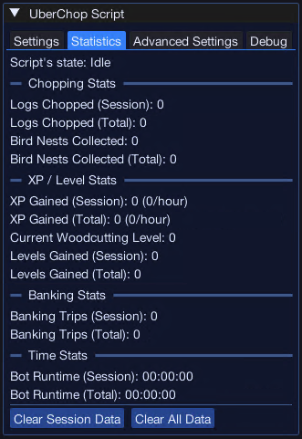

import React from 'react';
import TopBanner from '@site/src/components/TopBanner';
import ContentBlock from '@site/src/components/ContentBlock';
import Changelog from '@site/src/components/Changelog';
import BrowserWindow from '@site/src/components/BrowserWindow';
import changes from './changes.json';

<TopBanner title="UberChop" version="v0.1.2" author="Uberith" skill="Woodcutting">
</TopBanner>

:::hidden

## Cost

:::

<ContentBlock title="Cost">

 - **BETA**: FREE / month (not including client access)
 - **Post-Beta**: 5 Coins / Month (not including client access)

 **Beta ends November 15th**

</ContentBlock>

:::hidden

## Features

:::

<ContentBlock title="Features">

- **Automatic Navigation:**  
  Automatically navigates to precise, coordinate-based locations, ensuring efficient movement to tree spots and nearby banks.

- **Persistent Settings:**  
  Saves user preferences across sessions, including:
  - Selected tree locations
  - Tree types
  - Nest-pickup options

- **Human-like Random Delays:**  
  Implements fuzzy, randomized delays in interactions and navigation timings to simulate human behavior and enhance bot-detection resistance.

- **Intelligent Banking Automation:**  
  Detects when inventory is full, automatically navigates to the nearest bank, deposits logs, and resumes chopping.

- **Woodbox Support:**  
  Interacts with a wood box in inventory if present, storing logs to extend the duration of chopping sessions.

- **Magic Notepaper Support:**  
  Uses magic notepaper, if available, to convert logs directly in the inventory, freeing up space without needing to bank as often.

- **Crystallise Spell Support:**  
  Activates and manages the Crystallise spell, boosting woodcutting experience rates when conditions are met.

- **World Hopping:**  
  Automatically hops worlds when necessary, such as to avoid crowded areas or to maximize resource availability.

- **Statistics Page:**  
  Displays real-time statistics, such as:
  - Total logs chopped
  - Time elapsed
  - Experience gained

- **Advanced Settings Page:**  
  Provides additional customization options for users who want to fine-tune script behavior, offering greater control and flexibility.

- **Debug Page:**  
  Includes a debug page to facilitate troubleshooting, enabling users to identify and resolve issues more easily.

- **Supported Chopping Locations:**  
  Supports 12 locations for tree chopping:
  - Burthorpe
  - Draynor Village
  - Edgeville
  - Etceteria
  - Falador
  - Kharazi Jungle
  - Lumbridge
  - Menaphos
  - Seer's Village
  - Tai Bwo Wannai
  - Uzer
  - Varrock
  - Varrock Palace

- **Control Buttons:**  
  Start and stop the script easily using integrated controls.

<ContentBlock title="Supported Locations/Logs">

| Location        | Supported Logs                                                   |
|-----------------|:-------------------------------------------------------:|
| Burthorpe       | Tree, Oak                                               |
| Draynor Village | Tree, Oak, Willow, Elder tree                           |
| Edgeville       | Tree, Oak, Willow                                       |
| Falador         | Tree, Oak, Yew, Elder tree                              |
| Kharazi Jungle  | Teak, Mahogany                                          |
| Lumbridge       | Tree, Oak, Willow                                       |
| Menaphos        | Acadia                                                  |
| Seer's Village  | Tree, Oak, Willow, Maple Tree, Magic tree, Elder tree   |
| Tai Bwo Wannai  | Teak, Mahogany                                          |
| Uzer            | Tree, Teak                                              |
| Varrock         | Tree, Oak, Yew, Elder tree                              |
| Varrock Palace  | Tree, Oak, Yew                                          |

</ContentBlock>

#### Unsupported Trees

- Ivy
- Crystal

</ContentBlock>

:::hidden

## Requirements
:::
<ContentBlock title="Requirements">
    - Must be equipped with an axe appropriate for the trees.
    - If using a wood box, it must be compatible with the selected trees.
</ContentBlock>

<ContentBlock title="Product Roadmap">
> - **Player Suggestion:** Add support to have secondary actions if chopping high level trees (e.g. Elder Tree) to then do something else. Based on user input, it could begin chopping another tree (e.g. Yew), or teleport to another location to chop the high level tree.
> - Add support for lightform/crystalize
> - **Player Suggestion:** 
>   - Add Support for Ancient Elven Ritual Shard (for useage with lightform/crystalize)
>   - Add Support for Perfect JUJU Potions
>   - Add support for Destroy special mahogany logs
>   - Add support for Beaver pouches
>   - Add support for Incense Sticks
> - Add support for bank presets
> - Implement anomaly detection systems that monitor the script's behavior in real-time and adjust the actions if they seem too consistent or predictable. Randomize actions such as:
>   - Small variations in movement speed
>   - Occasional breaks or pauses
>   - Random interactions with other game objects (like inspecting a nearby item or interacting with another player).
</ContentBlock>

:::

<Changelog changes={changes} />